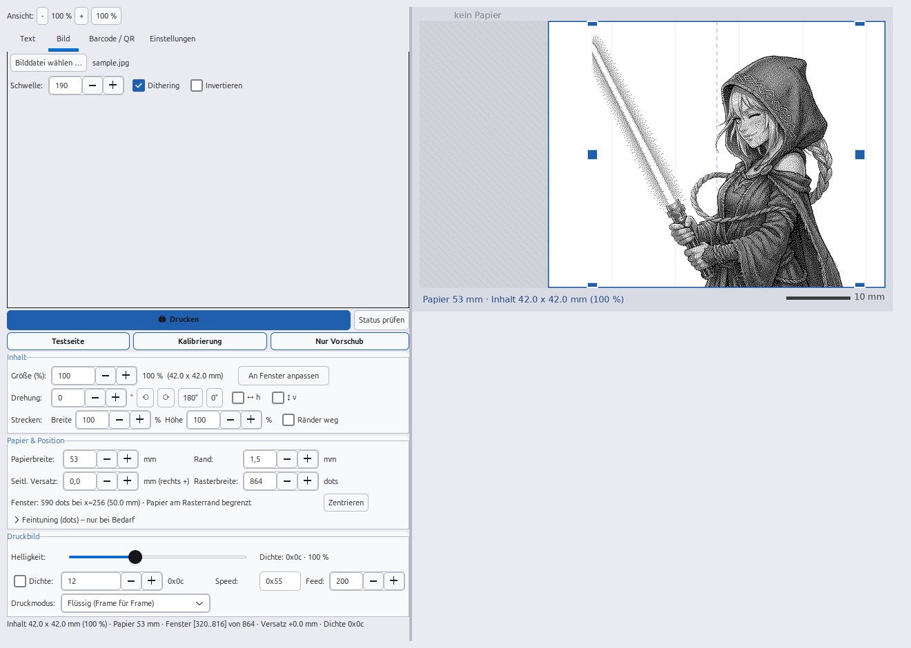
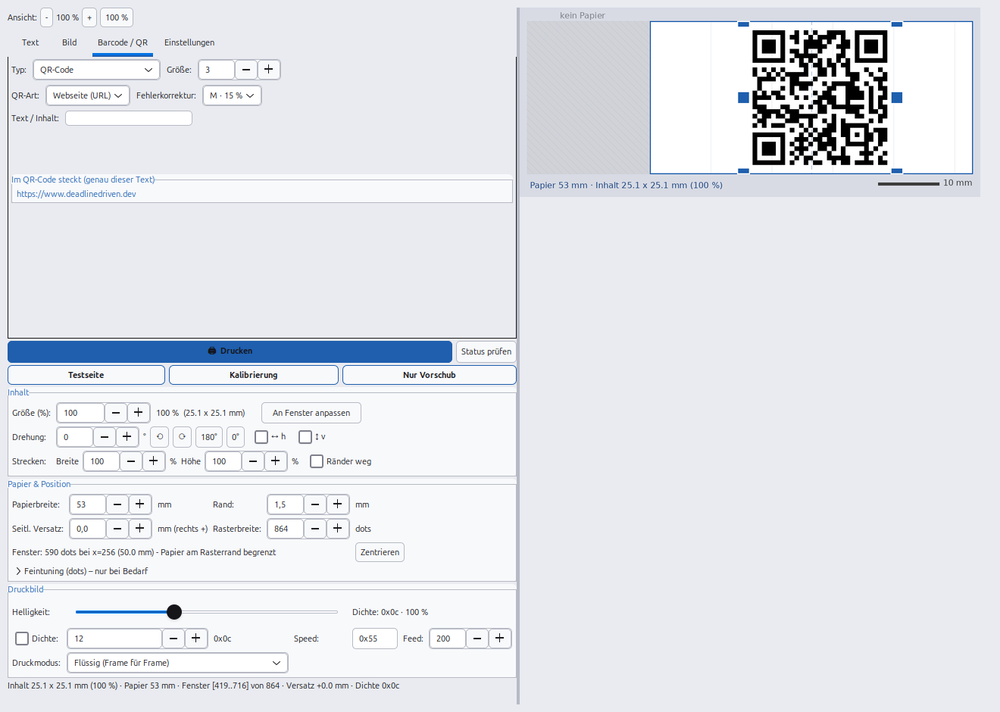

# Thermodrucker X3 unter Linux nutzen – Snap & Tag / ORGBRO X3 Treiber (Kommandozeile, CUPS, Oberfläche)

[English](README.md) · **Deutsch** · [日本語](README.ja.md) · [中文](README.zh.md)

[](#)
[](LICENSE)
[](#0-voraussetzungen--installation)
[-lightgrey.svg)](#0-voraussetzungen--installation)

**Vom Linux-PC drucken auf den Etikettendrucker „X3" (Snap & Tag, ORGBRO-X3-Familie) –
über Bluetooth, ohne root, ohne Handy.** Der kompakte **Thermodrucker** (864 dots @ 300 dpi)
ist sonst nur mit der Handy-App *Snap & Tag* bedienbar; dieses Projekt spricht sein
**YK/YZW-Frame-Protokoll** direkt – als **Kommandozeile** (`x3print.py`), als
**normaler Systemdrucker** über CUPS (Druckdialog von LibreOffice, Browser, PDF-Viewer …)
und als **Desktop-Programm mit Live-Vorschau** (`x3gui.py`, GTK3). Enthalten sind Text,
Markdown, Bilder (PNG/JPG/SVG), Memes, **QR-Codes** und **EAN-13-Barcodes**,
Helligkeit/Dichte, Drehen, Spiegeln, Strecken und Zuschneiden.
Oberfläche und Doku gibt es auf **Englisch, Deutsch, Japanisch und Chinesisch**.

Projekt-Webseite: **[www.deadlinedriven.dev](https://www.deadlinedriven.dev)**



*Der **Reiter „Bild“** mit dem mitgelieferten Beispielbild (`assets/sample.jpg`): Schwelle 190,
Dithering an, alle Maße in mm und blaue Griffe zum Ziehen und Skalieren – die Vorschau zeigt
das gerasterte Schwarz/Weiß-Ergebnis schon vor dem Drucken.*



*Der **Reiter „Barcode / QR“**: Art *QR-Code* wählen und festlegen, was hinein soll
(Webseite, WLAN-Zugang, Kontakt/vCard, E-Mail, Telefon, SMS, Standort oder freier Text).
Das Feld unter dem Formular zeigt genau, was im Code steckt – hier
`https://www.deadlinedriven.dev`, die Projekt-Webseite.*

> Diese Datei ist die **deutsche** Fassung. Die **englische Hauptfassung** steht in
> [`README.md`](README.md), außerdem gibt es [日本語](README.ja.md) und [中文](README.zh.md).

---

# Inhaltsverzeichnis

* [Was ist das?](#was-ist-das)
* [0) Voraussetzungen & Installation](#0-voraussetzungen--installation)
* [1) Als Systemdrucker einrichten (CUPS)](#1-als-systemdrucker-einrichten-cups)
* [2) Kommandozeile (x3print.py)](#2-kommandozeile-x3printpy)
* [3) Desktop-Programm (x3gui.py, GTK3)](#3-desktop-programm-x3guipy-gtk3)
* [Architektur & Diagramme](#architektur--diagramme)
* [Wie der Treiber funktioniert (detailliert)](#wie-der-treiber-funktioniert-detailliert)
* [Hardware-Daten](#hardware-daten-an-diesem-gerät-vermessen)
* [Häufige Probleme](#häufige-probleme)
* [Projektstruktur](#projektstruktur)
* [Schlagwörter (Suchbegriffe)](#schlagwörter-suchbegriffe)
* [Lizenz](#lizenz)

---

# Was ist das?

Der **X3** (auch als *Snap & Tag*-Drucker und *ORGBRO X3* verkauft) ist ein kleiner
**Bluetooth-Thermodrucker** für Etiketten, Klebenotizen, Adressaufkleber, Fotos,
QR-Codes und Barcodes – offiziell nur mit Android/iOS-App. Dieses Repository ist ein
**freier Linux-Treiber und Druckwerkzeug** für das Gerät:

* **kein ESC/POS** – der X3 nutzt ein eigenes Raster-Frame-Protokoll (reverse
  engineered; Quellen: [`isma-co/ORGBRO-X3-Windows`](https://github.com/isma-co/ORGBRO-X3-Windows),
  [`a-gians/Open-Orgbro`](https://github.com/a-gians/Open-Orgbro))
* **kein root, kein Kernel-Modul, kein `/dev/rfcomm0`** – einfacher Bluetooth-Socket aus Python
* **drei Druckwege**: Kommandozeile, CUPS-Warteschlange (`X3Thermo`), Desktop-Programm
* **ein gemeinsamer Kern**: CLI, Oberfläche und CUPS-Brücke nutzen dieselbe Aufbereitung

---

# 0) Voraussetzungen & Installation

**Kurzweg (empfohlen):** ein Skript prüft alles und richtet den Rest ein –
Details und eine ausführliche Schritt-für-Schritt-Anleitung stehen in
**[`INSTALL.md`](INSTALL.md)**.

```bash
./scripts/install.sh              # prüft Abhängigkeiten, Menü + Desktop-Symbol, Koppeln, CUPS
./scripts/install.sh --check      # nur prüfen, nichts ändern
./scripts/install.sh --help       # alle Optionen (--no-cups, --yes, --uninstall …)
```

**Hardware:** Der Drucker (WLAN/BT-Modell „X3" / ORGBRO-X3, 864 dots @ 300 dpi)
und ein Linux-PC mit Bluetooth. Koppeln mit `./scripts/pair.sh` (PIN meist `0000`);
eine **MAC-Adresse wird nirgends fest vorgegeben** – der Drucker wird
automatisch gesucht bzw. in der GUI/CLI ausgewählt.

**Systempakete** (einmalig, per sudo):

```bash
# Debian/Ubuntu
sudo apt install python3-pil python3-gi python3-gi-cairo gir1.2-gtk-3.0 \
                 bluez bluez-tools ghostscript
# Fedora
sudo dnf install python3-pillow python3-gobject gtk3 bluez ghostscript
```

**Python-Pakete** (ohne sudo, nur für die GUI/QR-Codes):

```bash
pip3 install -r requirements.txt          # Pillow (Pflicht)
# optional für QR-Codes:
pip3 install --user --break-system-packages qrcode
```

**Loslegen:**

```bash
./scripts/install.sh                              # Komplett-Installation (empfohlen)
./scripts/pair.sh                                 # Drucker koppeln (einmalig)
python3 x3print.py status                 # Verbindung testen
python3 x3print.py text 'Hallo Welt'      # erste Seite drucken
./x3gui.sh                                # Desktop-Programm starten
./scripts/install-desktop.sh                      # Menüeintrag + Desktop-Verknüpfung
./scripts/install-cups-user.sh                    # als Systemdrucker „X3Thermo" (ohne sudo)
```

**Selbsttest ohne Drucker** (prüft Rendering, Frame-Format, ESC/POS):

```bash
python3 tests/test_smoke.py               # Exit-Code 0 = alles OK
./x3gui.sh --selftest                     # GUI baut auf und rendert die Vorschau
python3 x3print.py --version              # Versionsnummer
```

---

# 1) Als Systemdrucker einrichten (CUPS)

**Bereits eingerichtet:** Der Drucker **`X3Thermo`** ist angelegt und in
allen Druckdialogen auswählbar (LibreOffice, Browser, PDF-Viewer …).
Testen:

```bash
echo "Hallo X3" | lp -d X3Thermo
lp -d X3Thermo /pfad/zu/datei.pdf
lpstat -p X3Thermo                    # Status prüfen
```

## Variante A (aktiv): Brücke ohne sudo – `scripts/install-cups-user.sh`

```bash
./scripts/install-cups-user.sh                # einrichten (kein sudo!)
./scripts/install-cups-user.sh --uninstall    # entfernen
```

Funktionsweise: CUPS leitet die Aufträge der Warteschlange an
`socket://127.0.0.1:9101`; der **systemd-User-Service `x3bridge`** nimmt sie
entgegen, rendert PDF/PostScript (Ghostscript), Bild- und Textdateien in das
YK-Rasterformat und sendet sie per Bluetooth an den Drucker. Vorteile:
keine Systemdateien, kein sudo; Nachteil: Der User-Service muss laufen
(läuft automatisch beim Anmelden).

```bash
systemctl --user status x3bridge      # Zustand
journalctl --user -u x3bridge -f     # Live-Log beim Drucken
```

Helligkeit: Umgebungsvariable `X3_BRIGHTNESS` im Service setzen
(`systemctl --user edit x3bridge` → `Environment=X3_BRIGHTNESS=130`).

## Variante B (Alternative): nativer CUPS-Treiber – `scripts/install-cups.sh`

```bash
sudo bash scripts/install-cups.sh             # einmalig, ggf. mit MAC als Argument
```

Installiert Backend `/usr/lib/cups/backend/x3bt`, Filter
`/usr/lib/cups/filter/x3raster` und die Warteschlange `X3Thermo`.
Dort gibt es im Druckdialog zusätzlich die Option
**„Druckdunkelheit (Helligkeit)“** (70/100/130/160 %).
Entfernen: `sudo bash scripts/install-cups.sh --uninstall`

> Vor dem Wechsel von A auf B die Variante A entfernen, sonst kollidiert
die Warteschlange `X3Thermo`.

---

# 2) Kommandozeile (x3print.py)

```bash
./scripts/pair.sh                              # Drucker einmalig koppeln (PIN 0000)
python3 x3print.py status              # Verbindung + Firmware prüfen

python3 x3print.py text "Hallo vom PC"
echo "Notiz vom $(date)" | python3 x3print.py text --align center --size 36
python3 x3print.py text --align center --size 48 --bold "WICHTIG!"
python3 x3print.py image logo.png
python3 x3print.py ean13 4006381333931
python3 x3print.py qr "https://example.org"        # QR: freier Text/URL
python3 x3print.py qr --type url example.org      # Webseite (https:// ergänzt)
python3 x3print.py qr --type wifi --ssid "MeinNetz" --password "geheim"
python3 x3print.py qr --type vcard --name "Max Muster" --phone "+49 170 123" \
    --email max@example.org --org "Firma"
python3 x3print.py qr --type email --to max@example.org --subject "Anfrage"
python3 x3print.py qr --type tel --phone "+49 30 1234567"
python3 x3print.py qr --type sms --sms-to "+49170123" --sms-text "Hallo"
python3 x3print.py qr --type geo --lat 52.5163 --lon 13.3777
python3 x3print.py meme foto.jpg --top "Hallo Welt" --bottom "Thermodrucker X3"
python3 x3print.py markdown --file liste.md --size 26
python3 x3print.py feed 200            # nur Papier vor
python3 x3print.py demo                # Demo-Seite

# Helligkeit / Druckdunkelheit (100 = Standard, >100 dunkler, <100 heller):
python3 x3print.py text --brightness 130 "dunkler drucken"
python3 x3print.py text --brightness 70 "heller drucken"
python3 x3print.py image --brightness 160 foto.png
python3 x3print.py text --density 0x14 "oder Dichte direkt (Hex)"

# Vorschau ohne Papier:
python3 x3print.py demo --out /tmp/vorschau.png
```

## Drucker wählen (universal: X3 **und** Standard-ESC/POS)

Im Tab **Einstellungen → Gruppe „Drucker“**:

| Feld | Bedeutung |
| --- | --- |
| **Gerät** | Drucker auswählen. **Suchen** startet eine Bluetooth-Suche (ca. 8 s) und listet alle Geräte – Drucker/gekoppelte Geräte stehen oben, gekoppelte sind markiert. „automatisch“ sucht den X3 selbst, „manuell“ erlaubt eine MAC-Eingabe. |
| **Testen** | verbindet sich mit dem gewählten Drucker und fragt den Status ab |
| **Protokoll** | **X3 / Snap & Tag (YK)** oder **ESC/POS** (Standard-Thermodrucker 58/80 mm) |
| **Modell** | Vorlage, die Protokoll, Papierbreite und Rasterbreite passend setzt: *X3 (53 mm, 864 dots)* · *ESC/POS 58 mm (48 mm, 384 dots)* · *ESC/POS 80 mm (72 mm, 576 dots)* |

Bei **ESC/POS** wird das übliche Rasterkommando (`GS v 0`) benutzt; die
X3-spezifischen Regler *Dichte*, *Speed* und *Druckmodus* sind dann
ausgegraut. Der CUPS-Drucker `X3Thermo` übernimmt das Protokoll ebenfalls
aus den Einstellungen. Kommandozeile: `--protocol escpos`.

Auch die **Bluetooth-Geräteliste** nutzt kein sudo (`bluetoothctl`):
```bash
python3 -c "import x3print; print(x3print.list_bluetooth_devices())"
```

## QR-Codes (Webseite, WLAN, Kontakt, …)

Der QR-Erzeuger steckt in der GUI (Tab *Barcode / QR*) und in der
Kommandozeile. Voraussetzung ist die Bibliothek `qrcode` (einmalig):

```bash
pip3 install --user --break-system-packages qrcode
```

| Art | Was der Code beim Scannen auslöst | Felder |
| --- | --- | --- |
| `url` | öffnet die Webseite im Browser (`https://` wird ergänzt) | Webadresse |
| `wifi` | richtet das WLAN automatisch ein (Android/iOS) | SSID, Passwort, WPA/WEP/offen, SSID versteckt |
| `vcard` | legt einen Kontakt an | Name, Telefon, E-Mail, Firma, Webseite |
| `email` | öffnet das Mailprogramm mit Empfänger/Betreff/Text | An, Betreff, Nachricht |
| `tel` | zeigt die Nummer zum Anrufen | Telefonnummer |
| `sms` | schreibt eine SMS vor | Nummer, Text |
| `geo` | öffnet die Karte an der Position | Breiten-/Längengrad |
| `text` | zeigt einfach den Text | beliebiger Text |

Sonderzeichen im WLAN-Passwort (`;` `,` `:` `"` `\`) werden automatisch
korrekt maskiert. **Fehlerkorrektur:** L (7 %) · M (15 %) · Q (25 %) ·
H (30 %) – für Thermopapier ist **H** empfehlenswert, weil der Code dann
auch bei Kratzern, Fingerabdrücken oder Verblassen noch lesbar ist
(dafür wird das Muster dichter, also eher große Codes drucken).
**Voreinstellung:** Im Tab *Barcode / QR* ist als QR-Art **„Webseite
(URL)“** vorgewählt und als Adresse **`www.deadlinedriven.dev`**
eingetragen (`https://` wird beim Erzeugen ergänzt) – Typ einfach auf
*QR-Code* stellen und drucken. Auch der **Starttext** im Tab
*Text / Layout* ist `www.deadlinedriven.dev`, die **Schriftgröße** steht
standardmäßig auf **35** (8–96 einstellbar).
**Tipp zum Prüfen:** Mit dem Handy scannen – bei WLAN fragt das Gerät
„Netzwerk beitreten?“. Alle hier erzeugten Varianten wurden zusätzlich
mit einem QR-Leser (zxing) gegengetestet und exakt zurückgelesen.

## Helligkeit / Druckdunkelheit

`--brightness PROZENT` (Standard 100) steuert die Schwärze des Drucks auf
zwei Ebenen:

1. **Drucker-Dichte** (Befehl `0x09`): wird aus dem Prozentwert berechnet.
   **Wichtig (am Gerät gemessen):** Das Dichte-Feld ist nur 4 Bit gültig
   (0x00–0x0f) – Werte darüber (z. B. 0x13) drucken **heller**, nicht
   dunkler! Deshalb gilt die Kennlinie 100 % → `0x0c`, 200 % → `0x0f`,
   70 % → `0x09`, 50 % → `0x07` (monoton, min `0x02`, max `0x0f`).
2. **Bild-Helligkeit** (nur bei `image`/über CUPS): Graustufen werden vor
   der Schwarz/Weiß-Umwandlung abgedunkelt bzw. aufgehellt – dadurch
   drucken Fotos/Logos satt bzw. heller (dieser Teil wirkt sehr deutlich).

Sinnvoller Wertebereich ca. 70–160 %. Wer die Dichte direkt setzen will,
nutzt `--density 0x..` (überschreibt die Berechnung; Werte 0x02…0x0f
verwenden, nicht größer!). Im CUPS-Druckdialog heißt die Option
**„Druckdunkelheit (Helligkeit)“** mit den Stufen 70/100/130/160 %.

---

# 3) Desktop-Programm (x3gui.py, GTK3)

Voll steuerbare grafische Oberfläche – ohne sudo, ohne Zusatzinstallation:

```bash
./x3gui.sh                # starten (Wrapper setzt Snapshot-Umgebung zurück)
```

Oder über das **Desktop-Symbol „X3 Thermodrucker“** (Schreibtisch und
Anwendungsmenü, Icon `assets/x3drucker.png`).

**Die Desktop-Verknüpfung legt das Programm selbst an:** beim ersten Start
landet automatisch ein Start-Symbol auf dem Schreibtisch (und der Eintrag im
Anwendungsmenü wird dabei mitgeschrieben). Von Hand geht es jederzeit über
*Einstellungen → Design → „Desktop-Verknüpfung: Erstellen / Entfernen“* oder
mit `./scripts/install-desktop.sh` (`--no-desktop-shortcut` = nur Menüeintrag,
`--uninstall` entfernt beides).

## Funktionen

Die Oberfläche ist in Gruppen gegliedert – **von oben nach unten**:
*Ansicht* (UI-Zoom) → **Inhalts-Tabs** (Text / Bild / Barcode & QR /
Einstellungen) → **🖨 Drucken** samt *Status prüfen* → **Testseite /
Kalibrierung / Nur Vorschub** → *Inhalt* → *Papier & Position* →
*Druckbild*. Seltene Feinwerte liegen im Aufklapper *Feintuning (dots)*.

**Hervorhebung:** *Drucken* ist der Hauptknopf und trägt die Akzentfarbe
des Designs (weiße/dunkle Schrift darauf, fett). Die drei Werkzeug-Knöpfe
*Testseite*, *Kalibrierung* und *Nur Vorschub* sind **sekundär**
hervorgehoben – Akzent-Rahmen und Akzent-Schrift auf normalem
Knopf-Hintergrund.

Das Fenster lässt sich **frei vergrößern und verkleinern** (linke Spalte
und Vorschau werden bei kleinen Fenstern scrollbar) und **merkt sich seine
Größe** für den nächsten Start. Die **linke Spalte ist so breit wie ihr
Inhalt nötig hat** (kein Abstand verschenkt, nichts wird abgeschnitten) –
der Rest gehört der **Vorschau**. Den **Trenner** kann man jederzeit
ziehen; ab dann gilt der eigene Anteil fürs Mitskalieren und wird
gespeichert. Oben links stellt **„Ansicht: – 100 % +“**
die UI-Größe des Menüs ein (70–140 %, Standard 100 %, wird gespeichert) –
so bleibt alles gut lesbar oder passt auf kleinere Fenster.

**Kompakt:** Abstände und Polster sind bewusst knapp gehalten (Rahmen 5 px,
Zeilenabstände 3–4 px, flache Reiter). Gemessen (Standardfenster 1320 x 940):
UI-Zoom 100 % → linke Spalte 904 px, 90 % → 848 px, 85 % → 818 px – die
komplette Spalte passt also **ohne Scrollen** ins Fenster.

- **Inhalte:** Text / **Markdown** / **Layout mit Textblöcken** (Größe,
  Ausrichtung, Fett, Strichstärke, Zeilenabstand), Bild (Schwelle,
  Dithering, Invertieren), EAN-13, QR-Code – alles im Tab *Text*.
- **Japanischer/chinesischer Text:** Schriftzeichen wie 日本語 oder 你好 werden
  automatisch mit einer CJK-Schrift (Noto Sans CJK, Droid Sans Fallback …)
  gesetzt – vorher wären sie als Kästchen gedruckt worden. Die Erkennung läuft
  beim Drucken und in der Vorschau (Maßangaben).
- **Markdown-Editor:** Der Text wird direkt als Markdown geschrieben und
  **live** gerendert – `# ## ###` Überschriften (automatisch größer),
  `**fett**`, `*kursiv*`, `~~durchgestrichen~~`, `` `Code` `` (Monospace),
  `- Aufzählung`, `1. Nummerierung`, `> Zitat` (mit Balken), `---`
  Trennlinie und **Bilder mitten im Text**: ``, mit Größe
  `{50%}` (Prozent der Breite) oder `{300}` (dots).
  Knopf **„Bild einfügen …“** setzt das Bild an der Schreibmarke ein,
  **„Format-Hilfe“** zeigt die Kurzübersicht. Der Markdown-Schalter aus
  = reiner Text. Der Text wird beim Beenden **gespeichert** und beim
  Start wieder geladen.
- **Layout mit Textblöcken (im selben Tab, unter dem Text):**
  * **Hintergrundbild** frei wählbar (`✕` entfernt es) – es wird mit
    **denselben Werten wie im Tab *Bild*** gedruckt: Schwelle, Dithering,
    Invertieren (Tab *Bild*) und Helligkeit (Gruppe *Druckbild*). Ohne
    Hintergrund entsteht ein weißes Blatt in der passenden Höhe.
  * **＋ Textblock hinzufügen** legt beliebig viele Blöcke an; jeder Block
    hat eigenen **Text**, **Position** (Oben / Mitte / Unten – mehrere
    Blöcke je Position werden gestapelt), **Stil**, **Größe** und
    **Ausrichtung** sowie `GROSSBUCHSTABEN`.
  * Stile: **Kontur** (weiße Schrift mit dicker schwarzer Umrandung –
    Meme-Look, auch auf Fotos lesbar), **Balken** (weiße Schrift auf
    schwarzem Balken – am kontrastreichsten) und **Schwarz** (normale
    Schrift). Zu große Schrift wird automatisch verkleinert, bis der Text
    in die Breite passt.
  * **Automatik:** Sobald ein Hintergrundbild oder ein Textblock gesetzt
    ist, wird dieses Layout gedruckt – sonst der Markdown-Text darüber.
    Beides wird gespeichert und beim nächsten Start wiederhergestellt.
- **Bilder inkl. SVG:** Über „Bilddatei wählen …“ lassen sich PNG/JPG/BMP/
  GIF/WebP **und SVG-Vektorgrafiken** laden (SVG wird gerendert, also
  scharf). **Beim ersten Start wird das mitgelieferte Beispielbild
  `assets/sample.jpg` geladen** – damit sieht das Programm auf jedem PC
  gleich aus; „✕“ bzw. ein eigenes Bild ersetzt es, und das zuletzt gewählte
  Bild wird gespeichert. Transparente Bereiche werden automatisch
  auf Weiß gelegt.
  **Beim Laden eines Bildes werden die bewährten Standardwerte gesetzt:**
  Drehung **0°**, Schwelle **190**, Dithering **an** – danach frei
  anpassbar; die Vorschau springt sofort auf das neue Bild (inkl.
  Wechsel in den Tab *Bild*).
- **Vorschau folgt dem Inhalt:** Beim Umschalten der Tabs *Text* / *Bild* /
  *Barcode / QR* (und beim Wechsel Strichcode ⇄ QR sowie beim Laden eines
  Bildes) wird die Vorschau **sofort neu aufgebaut** – kein Warten, kein
  manuelles Auslösen.
- **QR-Generator** (Tab *Barcode / QR* → Typ „QR-Code“): fertige Vorlagen
  für **Webseite (URL)**, **WLAN-Zugang**, **Kontakt (vCard)**, **E-Mail**,
  **Telefon**, **SMS**, **Standort (geo)** und **freier Text**. Je nach
  Auswahl erscheinen die passenden Felder (z. B. SSID/Passwort/
  Verschlüsselung bzw. Name/Telefon/E-Mail). Darunter zeigt das Feld
  *„Im QR-Code steckt“* genau den Text, der kodiert wird – so lässt sich
  alles vor dem Drucken prüfen. **Fehlerkorrektur** L/M/Q/H ist wählbar
  (H = am robustesten gegen Schmutz und Verblassen), die Größe begrenzt
  die Modulzahl automatisch auf das Druckfenster (bleibt dadurch scharf).
- **Gruppe „Inhalt“:** **Größe (%)** – skaliert den gesamten Inhalt
  (Text, Bild, Barcode, QR): 100 % = an das Druckfenster angepasst,
  kleiner = mehr Rand, größer = ragt hinaus (**rote** Bereiche werden
  nicht gedruckt). Direkt daneben stehen **die Maße live** (z. B.
  „80 % (39,5 x 12,4 mm)“), ebenso in der Statuszeile und als Beschriftung
  im Vorschaubild – auch während man an den blauen Ecken zieht. Button
  „An Fenster anpassen“ setzt auf 100 % zurück.
- **Bildbearbeitung** (gilt für alle Inhalts-Tabs):
  * **Drehung** – Gradzahl (positiv = gegen den Uhrzeigersinn) oder
    Knöpfe **⟲ 90° / ⟳ 90° / 180° / 0°**. Ist der gedrehte Inhalt
    breiter als das Druckfenster, wird er automatisch passend
    verkleinert (kein Überstand).
  * **Spiegeln** – horizontal und/oder vertikal
  * **Strecken** – Breite und Höhe getrennt in % (100 = unverändert;
    damit lässt sich ein Motiv z. B. breiter ziehen, ohne es höher
    zu machen)
  * **leere Ränder abschneiden** – schneidet weiße Ränder des Motivs
    ringsum ab
  Alle Werte werden gespeichert und gelten auch für die nächsten Drucke.
- **Gruppe „Papier & Position“:** **Papierbreite in mm** (z. B. 53 mm),
  **Rand in mm**, **seitlicher Versatz in mm** (± rechts/links zum
  Feintuning), **Rasterbreite (dots)** – daraus wird das Druckfenster
  automatisch berechnet. Feintuning im Aufklapper: *Papier-Mitte (dots)*,
  *Druckfenster links/Breite*. Darunter eine Infnzeile mit allen Maßen
  in dots und mm.
- **Gruppe „Druckbild“:** Helligkeit (40–200 %) mit Dichte-Anzeige,
  **Dichte manuell überschreiben**, Geschwindigkeit (Hex), Vorschub und
  **Druckmodus:** *Flüssig (Frame für Frame)* – ein Raster-Frame (432 Byte)
  pro Schreibvorgang – oder *Turbo (große 16-KB-Blöcke)*. Beide Modi senden
  **ohne Pausen**: Der Puffer des Druckers gibt das Tempo vor, der Motor
  läuft durch (kein Stopp mitten in der Seite).
- **Gruppe „Gerät“:** MAC-Adresse
- **Vorschau in Original-Proportionen:** Die **bedruckbare Fläche ist
  weiß mit blauem Rahmen** hervorgehoben, alles außerhalb ist grau
  schraffiert („kein Papier“). Dazu **mm-Rasterlinien alle 10 mm**,
  blaue Mittellinie und Statuszeile mit allen Maßen.
  Die Farben erklärt ein **Tooltip** über der Vorschau (weiß = bedruckbar,
  schraffiert = kein Papier, rot = ragt hinaus, blau = Papier-Mitte) –
  die Legende belegt keinen Platz mehr.
  Die **Maße stehen in einem eigenen Rand unter dem Druckbild**
  („Papier 53 mm · Inhalt 39,5 x 12,4 mm (80 %)“) und der **10-mm-Maßstab**
  rechts daneben – **nichts überdeckt den Inhalt**, und unter der Vorschau
  steht kein zusätzlicher Tipptext mehr (die Bedienhinweise erscheinen als
  Tooltip über der Vorschau).
  Die Vorschau wird **immer so skaliert, dass der gesamte Ausdruck in
  die Fläche passt** (auch bei hohen/gedrehten Inhalten) und folgt
  automatisch der Fenstergröße.
- **Position & Größe per Drag & Drop – ohne Grenzen:** In der Vorschau
  **links ziehen** = Druck frei verschieben (bis über den Rand hinaus;
  Teile außerhalb der bedruckbaren Fläche werden **rot** markiert und
  nicht gedruckt). **An den blauen Ecken ziehen** = Größe **diagonal**
  ändern (proportional; die gegenüberliegende Ecke bleibt stehen, der
  Mauszeiger zeigt den Diagonal-Pfeil). **An den blauen Kanten (Mitte)
  ziehen** = nur die Breite ändern. **Rechts ziehen** = Papierfenster
  verschieben (Modell an das echte Papier anpassen). Button
  **„Zentrieren“** setzt den Versatz auf 0 zurück, **„An Fenster
  anpassen“** die Größe auf 100 %. Jede Änderung wird automatisch
  gespeichert.
- **Werkzeuge:** Testseite, Kalibrierung, nur Vorschub
- **Einstellungen-Tab:** **Design** (Farbschema) und **Sprache**,
  Drucker-Auswahl, Firmware/Status auslesen, **Rohbefehl (Hex) senden**
- **Design (Farbschema), Tab *Einstellungen* → Gruppe *Design*:** Drei
  Oberflächen-Designs, die sofort umschalten und gespeichert werden
  (beim ersten Start: **Hell**):
  * **Dunkel** – dunkle Oberfläche
  * **Hell** – helle Oberfläche für helle Umgebungen (Standard)
  * **DeadlineDriven** – das Farbschema von **deadlinedriven.dev**
    (Schwarz `#000`, Türkis `#00d2be`, Orange `#ff6a00`, warmer Text
    `#f0ede8`) – inklusive türkiser Vorschau-Markierungen
  Es werden Fenster, Felder, Buttons, Tabs (aktiver Tab = Akzentlinie),
  Regler, Auswahlfelder, Scrollbalken, **Klapplisten** und Tooltips
  eingefärbt. Wichtig: Die System-Designvorlage (Yaru/Adwaita **dark**)
  malt Buttons und Felder mit Farbverläufen, füllt die
  **Notebook-Inhaltsfläche** dunkelgrau und würfelt die **Auswahl in
  Klapplisten**; die App schaltet die Verläufe per
  `background-image: none` ab, färbt die Inhaltsfläche extra
  (`notebook stack`) und setzt für Klapplisten-Einträge eigene Farben
  (Maus darüber = Akzentfarbe mit passender Schrift) – sonst wäre die
  Schrift im hellen Design nicht lesbar.
- **Sprache (English / Deutsch / 日本語 / 中文), Tab *Einstellungen* →
  Gruppe *Design*:** Umschalter mit Flaggen (🇺 English, 🇩🇪 Deutsch,
  🇯🇵 日本語, 🇨🇳 中文 (普通话)) – die Oberfläche wird **sofort** in der
  gewählten Sprache neu aufgebaut (Fenstergröße/-position bleiben) und die
  Auswahl gespeichert (`lang`). Übersetzt werden Beschriftungen, Knöpfe,
  Tab- und Gruppentitel, Klapplisten, Statuszeile, Vorschau-Beschriftungen
  und Meldungen; die Texte liegen in `i18n.py`. **Englisch ist die
  Ausgangssprache des Codes**, die anderen Sprachen sind Übersetzungen;
  ohne gespeicherte Auswahl folgt die Oberfläche der Systemsprache
  (`LANG`), sonst Englisch.
- Alle Einstellungen werden automatisch in
  `~/.config/x3drucker.json` gespeichert und beim Start geladen

**Papierbreite & Zentrierung einstellen:** *Papierbreite (mm)* auf die
eigene Rolle setzen (z. B. 53). Passt der Druck nicht genau mittig, einfach
**in der Vorschau ziehen** (Drag & Drop) oder *Seitl. Versatz (mm)*
nachjustieren (positiv = nach rechts) – die Vorschau zeigt jede Änderung
sofort, „Zentrieren“ setzt den Versatz zurück.

Die GUI nutzt den direkten Bluetooth-Treiber (unabhängig vom CUPS-Drucker)
und druckt mit den exakt eingestellten Parametern. **Auch der CUPS-Drucker
`X3Thermo` übernimmt diese Werte** (Papier-/Fenstergeometrie und Helligkeit
aus `~/.config/x3drucker.json`).

---

# Architektur & Diagramme

Die **technische Dokumentation** liegt unter [`docs/`](docs/README.md)
(englisch: Aufbau, Protokoll, Bibliotheks-API, CUPS-Wege) mit allen
Zusammenhängen als **PlantUML-Diagramme** in
[`docs/diagrams/`](docs/diagrams/README.md) – mit Quellen (`.puml`) und
gerenderten Bildern (SVG + PNG):

* **Überblick:** Anwendungsfälle, Architektur (Komponenten), Verteilung
* **Abläufe:** Druck über die Kommandozeile, Druck über CUPS, Bedienung der
  Oberfläche, Aufbereitung des Druckbildes, Installation
* **Struktur:** Klassen von Treiber/Renderer und der Oberfläche,
  Verbindungs-Zustände, Oberflächen-Wireframe, Hardware-Fakten

Neu rendern (nach Änderungen an den Quellen):

```bash
docs/diagrams/build.sh
```

---

# Wie der Treiber funktioniert (detailliert)

## 1. Bluetooth-Verbindung

- Der Drucker bietet **SPP** (Serial Port Profile) auf **RFCOMM-Kanal 1** an.
  (Eine SDP-Abfrage liefert beim X3 nichts – Kanal 1 ist Standard.)
- Verbunden wird **ohne** `/dev/rfcomm0` und **ohne sudo**: direkt per
  Bluetooth-Socket aus Python:

  ```python
  socket.socket(socket.AF_BLUETOOTH, socket.SOCK_STREAM, socket.BTPROTO_RFCOMM)
  sock.connect((mac, 1))
  ```

- Voraussetzung: Das Gerät ist einmal gekoppelt und als *trusted* gesetzt
  (`./scripts/pair.sh`, Legacy-Pairing, PIN `0000`). Die MAC wird automatisch aus
  `bluetoothctl devices` erkannt (Name `X3`).

## 2. Das YK/YZW-Frame-Protokoll

Jeder Befehl ist ein Frame – **nicht** ESC/POS:

```
64 <cmd> <seq> <len_lo> <len_hi> <payload …> 00 00 00 00 9b
```

| cmd  | Bedeutung              | Payload                        |
|------|------------------------|--------------------------------|
| 0x80 | Token/Init             | `01`                           |
| 0x11 | Firmware-Abfrage       | – (Antwort: `64 f1 …`)         |
| 0x10 | Status-Abfrage         | – (Antwort: `64 ff …`)         |
| 0x0A | Geschwindigkeit        | 1 Byte (z. B. `0x55`)          |
| 0x09 | Dichte                 | 1 Byte (z. B. `0x0c`)          |
| 0x02 | Papiervorschub         | Schritte, little-endian 16 bit |
| 0x00 | Raster-Bilddaten       | 432 Bytes Bilddaten            |

- `seq` ist eine laufende Nummer, die pro Frame erhöht wird.
- Ein Druckauftrag folgt immer dem Muster (aus Android-Capture):
  **Speed → Dichte → viele Raster-Frames → Vorschub**.

## 3. Drucken = Rasterbild, nicht Text

Der Drucker kennt **keine Textbefehle**. Alles (Text, Foto, Barcode, QR)
wird in ein **1-Bit-Bild** (Bit gesetzt = schwarz, MSB zuerst) gerastert und
als Bildsequenz gedruckt. Je Raster-Frame werden **432 Bytes** gesendet –
bei 864 Bildpunkten Breite sind das **4 Zeilen à 108 Bytes**.

Der ganze Auftrag geht in **einem Zug** zum Drucker: **keine künstlichen
Pausen** zwischen den Frames, getaktet wird allein von der
Bluetooth-Flusskontrolle (das Schreiben blockiert, solange der Drucker
beschäftigt ist). Eine Pause im Datenstrom lässt den Motor anhalten – der
Druck stockt dann mitten in der Seite. Erst nach dem letzten Frame wird die
Verbindung geschlossen, und zwar erst, wenn der Drucker eine Statusabfrage
beantwortet hat (die Antwort kommt erst, wenn er alle Daten gelesen hat).

## 4. Rendering-Pipeline (x3print.py, CLI)

```
Text / Datei ─► Pillow: Schrift (DejaVu), Umbruch, Ausrichtung
Bilddatei    ─► Pillow: Graustufen, Schwellwert/Dithering, Skalierung
EAN-13       ─► eigener Encoder (L/G/R-Tabellen) → Balken
QR           ─► qrcode-Bibliothek (optional)

        ▼
  1-Bit-Bild (0=schwarz), Breite = Inhaltsbreite (500 px)
        ▼
  Einbetten in 864-dot-Raster bei x=320 (weißer Rand drumherum)
        ▼
  Bytes packen (MSB first) + Höhe auf 4er-Zeilen auffüllen
        ▼
  Frames: Speed → Dichte → 432-B-Raster-Frames → Vorschub
        ▼
  RFCOMM-Socket an MAC, Kanal 1
```

Text wird lokal als Grafik gerendert – dadurch gibt es **keine
Codepage-Probleme** mit Umlauten (Ä Ö Ü ß € werden direkt aus der
DejaVu-Schrift gezeichnet).

## 5. Geometrie: 864-dot-Kopf & Druckfenster

Am Gerät vermessen (siehe `calibrate`):

- Der Druckkopf hat **864 dots bei 300 dpi** (108 Bytes/Zeile).
  Es gibt auch X3-Varianten mit 432 dots @ 203 dpi – dann `--dots 432`.
- Das **bedruckbare Fenster** auf dem Papier liegt ca. bei Raster-Bildpunkt
  **300…845** (nicht bei 0!). Deshalb sitzt der Inhalt (500 dots breit) bei
  **x = 320** im Raster, damit er mittig auf dem Papier erscheint.
- Falsches Framing (z. B. 432-dot-Daten auf dem 864-Kopf) ergibt zerhackten,
  blassen Druck oder einen schwarzen Balken am Rand.

## 6. CUPS-Modus: Filter `x3raster` + Backend `x3bt`

Beim Drucken über den Systemdialog durchläuft der Auftrag eine Kette:

```
App (PDF/PS/Text/Bild)
   │
   ▼ CUPS-Warteschlange "X3Thermo" (PPD: 300 dpi, Graustufen)
   ├─ CUPS liefert den Auftrag als PDF/PS an den Filter
   │
   ▼ Filter /usr/lib/cups/filter/x3raster   (läuft als Benutzer "lp")
   ├─ Ghostscript rendert jede Seite → Graustufen-PNG @ 300 dpi
   ├─ Pillow: auf Inhaltsbreite (500 px) skalieren
   ├─ Schwellwert → 1-Bit (schwarz/weiß), weiße Ränder beschneiden
   ├─ Einbetten ins 864-dot-Raster (x=320)
   └─ YK-Frames bauen (Speed → Dichte → Raster → Vorschub), an stdout
   │
   ▼ Backend /usr/lib/cups/backend/x3bt     (läuft als root)
   └─ liest die Frames von stdin und sendet sie per Bluetooth/RFCOMM
      an den Drucker (MAC aus der Device-URI x3bt://<MAC>)
```

- **Filter** (`cups/x3raster.py`): PDF/PostScript von stdin → YK-Frames auf
  stdout. Mehrseitige Dokumente werden Seite für Seite gedruckt, dazwischen
  gibt es einen kleinen Vorschub, am Ende einen großen.
- **Backend** (`cups/x3bt.py`): reine Weiterleitung stdin → Bluetooth-Socket.
  Ohne Argumente gibt es die Geräteliste für die CUPS-Erkennung aus
  (`direct x3bt://… "X3 Thermo …"`).
- Beide sind **selbstständig** (nur Python-Standardbibliothek + Pillow im
  Filter) und unabhängig vom Projektordner installiert.
- Das PPD (`cups/x3thermo.ppd`) deklariert ein Etikettenformat
  (42,3 × 250 mm, 300 dpi) und `cupsFilter2: application/pdf 0 x3raster`,
  wodurch CUPS die üblichen Eingabeformate (PDF, PostScript, Bilder, Text)
  auf den Filter umleitet.

## 7. Ablauf eines Druckvorgangs – Schritt für Schritt

1. Du wählst in einer App „X3Thermo" und drückst Drucken.
2. CUPS erzeugt (falls nötig) aus dem Dokument ein PDF und ruft den Filter
   `x3raster` auf.
3. Ghostscript rendert das PDF bei 300 dpi; Pillow skaliert/binarisiert es
   auf die Druckbreite und schneidet weiße Ränder weg.
4. Der Filter schreibt die YK-Frames auf stdout, CUPS leitet sie an das
   Backend `x3bt` weiter.
5. Das Backend verbindet sich per Bluetooth (RFCOMM Kanal 1) und sendet die
   Frames; der Drucker druckt das Bild und schiebt das Papier vor.

---

# Hardware-Daten (an diesem Gerät vermessen)

| Größe | Wert |
|-------|------|
| Druckkopf | **864 dots @ 300 dpi** (108 Bytes/Zeile) |
| Raster-Frame | 432 Bytes = 4 Zeilen |
| bedruckbares Fenster | ca. Bildpunkt **292…823** (≈ 45 mm) |
| Inhaltsfläche (Default) | **495 dots**, links bei **x=311** (Rand 1,5 mm) |
| Verbindung | Bluetooth SPP, RFCOMM Kanal 1 |

---

# Häufige Probleme

- **„Keine Verbindung"** → Drucker einschalten; einmalig `./scripts/pair.sh`
  (PIN `0000`), Gerät muss *trusted* sein.
- **Drucker verbindet sich nicht mehr** (`timed out`) → Die Bluetooth-Sitzung ist
  verwaist: Der X3 erlaubt nur **einen** Client, deshalb blockiert eine alte
  Sitzung den Kanal, obwohl der PC `Connected: yes` meldet. Der Treiber trennt
  die Verbindung selbst und versucht es erneut (der erste Druck dauert dann ein
  paar Sekunden länger). Von Hand: `bluetoothctl disconnect <MAC>` oder den
  Drucker aus- und wieder einschalten.
- **`Device or resource busy`** → Der Drucker arbeitet noch am vorherigen
  Auftrag – kurz warten, der Treiber versucht es selbst erneut.
- **CUPS: Auftrag hängt/fehlgeschlagen** →
  `grep -i x3 /var/log/cups/error_log | tail` ansehen. Evtl. blockiert
  AppArmor den Python-Filter – dann CUPS-Profile prüfen
  (`sudo aa-status | grep cups`) oder `sudo dmesg | grep -i apparmor`.
- **Druck verdoppelt/zerhackt** → falsche Rasterbreite: `--dots` prüfen
  (432 vs. 864).
- **Drucker stoppt mitten im Bild** → Der Druckkopf war schneller als der
  Datenstrom. Beide Modi senden **ohne Pausen** (der Druckerpuffer gibt das
  Tempo vor); ein Stopp bedeutet also, dass Daten fehlen: Bluetooth-Link
  prüfen (Drucker in der Nähe, kein zweites Gerät gleichzeitig verbunden),
  `--delay` **nicht** setzen und `--mode fast` (größere Blöcke) probieren.
  Bei sehr dunklen/großen Bildern kann zusätzlich die Wärme des Druckkopfs
  bremsen – dann Dichte senken oder Pause zwischen den Aufträgen lassen.
- **Inhalt nicht mittig/abgeschnitten** → `--width`/`--left` anpassen
  (mit `calibrate` das Fenster ermitteln).
- **Zu blass** → `--thicken 1` bzw. Dichte `--density 0x0e`…`0x12`,
  Geschwindigkeit `--speed 0x40`. Inhalt vergrößern/verkleinern geht mit
  `--zoom PROZENT` (CLI) bzw. *Größe (%)* (GUI).
- **Bluetooth-Gerät weg** → `timeout 15 bluetoothctl scan on`, dann
  `bluetoothctl devices` prüfen.

---

# Projektstruktur

```
x3print.py            CLI-Treiber (Bibliothek + Kommandozeile)
x3gui.py              Desktop-Programm (GTK3, Vollversion)
x3gui.sh              Start-Wrapper (bereinigt Snap-Umgebungsvariablen)
i18n.py               Übersetzungen DE / EN / JA / ZH
assets/
  x3drucker.png       App-Icon (256x256)
  sample.jpg          Beispielbild (Startbild beim ersten Start, 2048x2048)
scripts/
  install.sh          Komplett-Installer (Prüfen, Menü, Koppeln, CUPS)
  install-desktop.sh  Menüeintrag + Symbol + Desktop-Verknüpfung (kein sudo)
  install-cups-user.sh Einrichtung OHNE sudo (Warteschlange + User-Service)
  install-cups.sh     Einrichtung MIT sudo (nativer CUPS-Treiber)
  pair.sh             Bluetooth-Kopplung (MAC wird automatisch gesucht)
  x3drucker.desktop   Vorlage für den Startmenü-Eintrag (@EXEC@/@ICON@)
cups/
  x3bridge.py         Brücken-Dienst (CUPS socket:// → Bluetooth) [aktiv]
  x3raster.py         CUPS-Filter  (PDF/PS → YK-Frames)           [Variante B]
  x3bt.py             CUPS-Backend (Frames → Bluetooth)           [Variante B]
  x3thermo.ppd        Drucker-PPD (Etikett, 300 dpi)              [Variante B]
docs/
  README.md           Technische Doku (englisch): Aufbau, Protokoll, API
  diagrams/           PlantUML-Diagramme: README.md (Index), *.puml (Quellen),
                      *.svg / *.png (Bilder), build.sh (neu rendern)
  images/             Screenshots der Oberfläche in vier Sprachen:
                      gui-image-*.png (Reiter Bild), gui-*.png (Reiter Text),
                      gui-qr-*.png (Reiter Barcode / QR)
tests/test_smoke.py   Selbsttests ohne Drucker (Rendering, Frames, ESC/POS)
INSTALL.md            Installationsanleitung (Schritt für Schritt)
requirements.txt      Python-Abhängigkeiten (Pillow; qrcode optional)
CHANGELOG.md          Versionshistorie
LICENSE               MIT-Lizenz
README.md             Anleitung, englisch (Hauptfassung)
README.de.md          Anleitung, deutsch (diese Datei)
README.ja.md          Anleitung, japanisch
README.zh.md          Anleitung, chinesisch
```

**Hinweis zur Sprache:** Quellcode, Kommentare, Docstrings, CLI-Ausgaben und die
technische Doku unter `docs/` sind **englisch**. Diese Bedienungsanleitung gibt es
in vier Sprachen – **[English](README.md)**, **Deutsch** (diese Datei),
[日本語](README.ja.md) und [中文](README.zh.md); `INSTALL.md` und `CHANGELOG.md`
sind deutsch. Die Oberfläche selbst lässt sich zwischen Englisch, Deutsch,
Japanisch und Chinesisch umschalten (`i18n.py`).

QR-Codes in der CLI brauchen optional:
`pip3 install --user --break-system-packages qrcode`

---

# Schlagwörter (Suchbegriffe)

**Deutsch:** Thermodrucker Linux · Bluetooth Thermodrucker · Snap & Tag Drucker ·
ORGBRO X3 · Etikettendrucker · Bon-Drucker · Kassenzettel · Aufkleber drucken ·
Thermodrucker Treiber · CUPS Bluetooth Drucker · QR-Code drucken · Barcode drucken
(EAN-13) · Markdown drucken · Linux drucken ohne Handy-App · Python · GTK3 ·
Thermodrucker Oberfläche · Rückseiten-Engineering Druckerprotokoll.

**English:** thermal printer Linux · Bluetooth thermal printer · Snap & Tag printer ·
ORGBRO X3 · label printer · receipt printer · thermal printer driver · CUPS Bluetooth
printer · QR code printer · barcode printer · Markdown printing · GTK3 app.

**日本語:** サーマルプリンター Linux · Bluetooth サーマルプリンター · ラベルプリンター ·
QR コード 印刷 · CUPS プリンター · スマホなしで印刷.

**中文:** 热敏打印机 Linux · 蓝牙热敏打印机 · 标签打印机 · 小票打印机 · QR 码打印 ·
Linux 打印驱动 · 免手机打印.

---

# Lizenz

**MIT-Lizenz** – siehe [`LICENSE`](LICENSE). Copyright (c) 2026 Marc Nauendorf.
Kurz gesagt: Nutzung, Weitergabe und Änderung sind erlaubt, solange der
Copyright-Hinweis erhalten bleibt; keine Gewährleistung.

Enthaltene Fremd-Protokolldokumentation stammt aus den oben genannten
Reverse-Engineering-Projekten (GitHub); das Projekt steht in keiner
Verbindung zum Hersteller der Drucker.
