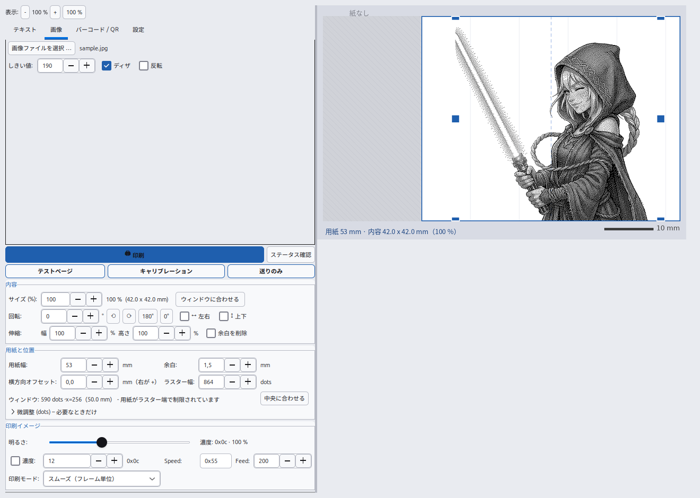
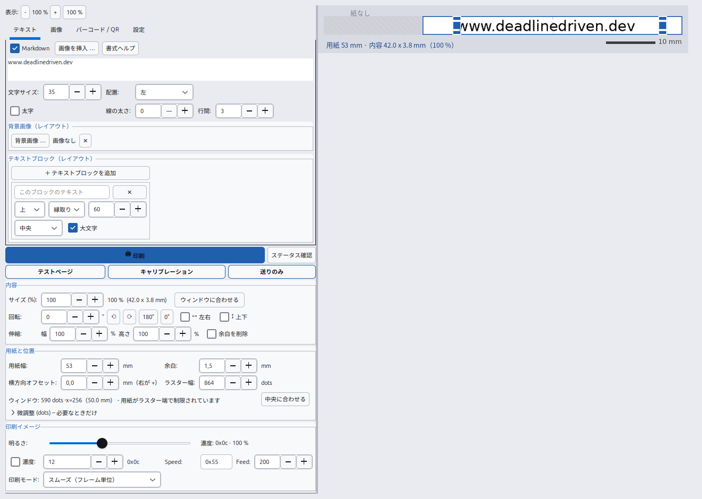

# Linux で X3 サーマルプリンターを使う – Snap &amp; Tag / ORGBRO X3 ドライバー（CLI・CUPS・GUI）

[English](README.md) · [Deutsch](README.de.md) · **日本語** · [中文](README.zh.md)

[](#)
[](LICENSE)
[](#必要なもの)

**Linux の PC から Bluetooth 経由で「X3」サーマルプリンター（Snap &amp; Tag、ORGBRO X3 系）に
印刷します。root 権限もスマートフォンも不要。** このプリンターは通常 Android/iOS アプリ
*Snap &amp; Tag* でしか使えません。本プロジェクトは独自の **YK/YZW フレームプロトコル**を
直接扱い、**コマンドライン**（`x3print.py`）、**CUPS のシステムプリンター**（LibreOffice・
ブラウザ・PDF ビューアの印刷ダイアログに `X3Thermo` として表示）、**ライブプレビュー付きの
デスクトップアプリ**（`x3gui.py`、GTK3）の 3 通りで印刷できます。テキスト、Markdown、画像
（PNG/JPG/SVG）、ミーム、**QR コード**、**EAN-13 バーコード**、明るさ・濃度、回転、反転、
引き伸ばし、余白の切り取りに対応。**英語・ドイツ語・日本語・中国語**の UI とドキュメント。

プロジェクトのウェブサイト: **[www.deadlinedriven.dev](https://www.deadlinedriven.dev)**



***「画像」タブ**と同梱のサンプル画像（`assets/sample.jpg`）：しきい値 190、ディザリング有効、
mm 単位の寸法、青いハンドルでドラッグ／拡大縮小。印刷前に白黒の結果を確認できます。*



*同じプログラムの**「テキスト」タブ**：左側に操作項目、右側にミリ単位のライブプレビュー
（ここではウェブサイト `www.deadlinedriven.dev` を表示。QR コードの初期値と同じ内容です）。*

---

## 主な機能

* **テキスト印刷**（サイズ、中央/左右揃え、太字、線幅、行間）、標準入力からも印刷可能
* **日本語・中国語・韓国語のテキスト** – CJK フォント（Noto Sans CJK など）を自動で選ぶため、
  日本語や中国語が「豆腐」（□）にならず、正しい文字で印刷されます
* **Markdown**: 見出し、太字、斜体、取り消し線、コード、リスト、引用、区切り線、本文中の画像
  （``、`{50%}` や `{300}` で幅指定）
* **レイアウトモード**: 背景画像 + 任意個のテキストブロック（上/中央/下、輪郭・帯・黒）
* **画像**: PNG、JPG、BMP、GIF、WebP、**SVG**（拡大しても綺麗）、しきい値・ディザリング・反転
* **ミームモード**: 写真に上下のテキスト（輪郭付きで読みやすい）
* **EAN-13 バーコード** と **QR コード**（ウェブサイト、Wi-Fi、連絡先 vCard、メール、電話、SMS、位置情報、テキスト）
* テストページ、キャリブレーション用の目盛り、用紙送り
* **プリンターなしでプレビュー**（`--out` で PNG 保存）
* **画像編集**: 明るさ 70–200 %、濃度（4 bit）、回転（任意角度／90° 単位は無劣化）、反転、
  縦横別の引き伸ばし、余白の自動切り取り
* **デスクトップアプリ**: mm 単位のライブプレビュー、ドラッグで位置、角で拡大縮小、
  3 種類のテーマ、UI 倍率 70–140 %、設定は `~/.config/x3drucker.json` に保存
* **デスクトップショートカット**を初回起動時に自動で作成（root 不要）
* **CUPS**: `X3Thermo` というキューを作成（sudo 不要のブリッジ方式、またはネイティブのフィルター方式）

## 対応プリンター

| プリンター | プロトコル | 状態 |
|---|---|---|
| **X3 / Snap &amp; Tag**（ORGBRO X3 系、864 dots @ 300 dpi、53 mm 用紙） | Bluetooth SPP 上の YK/YZW フレーム | **実機で検証済み** |
| 一般的な **ESC/POS** サーマルプリンター 58 mm / 80 mm（384 / 576 dots） | `GS v 0` ラスター、`ESC J` 送り | `--protocol escpos` またはモデル選択で対応 |

## 必要なもの

* **Linux** と Python **3.9+**（Ubuntu 24.04 で検証、Debian/Ubuntu・Fedora・Mint で動作）
* **Bluetooth**（BlueZ）とペアリング済みのプリンター
* Python **Pillow**、デスクトップアプリには GTK3、QR コードには `qrcode`（任意）、
  CUPS 経由の PDF には Ghostscript（任意）

```bash
# Debian / Ubuntu / Mint
sudo apt install python3-pil python3-gi python3-gi-cairo gir1.2-gtk-3.0 \
                 bluez bluez-tools ghostscript
# Fedora
sudo dnf install python3-pillow python3-gobject gtk3 bluez ghostscript
```

## インストールと開始

```bash
git clone https://github.com/Nr44suessauer/ThermalPrinterX3.git
cd ThermalPrinterX3
chmod +x *.sh scripts/*.sh

./scripts/install.sh --check      # 依存関係の確認（変更なし）
./scripts/install.sh              # メニュー登録 + ショートカット + ペアリング + CUPS（任意）
./scripts/pair.sh                 # プリンターをペアリング（PIN は通常 0000）
./x3gui.sh                        # デスクトップアプリを起動
```

## コマンドラインの例

```bash
python3 x3print.py status                       # 接続とファームウェア/ステータス
python3 x3print.py text "PC からの印刷"          # 最初の 1 枚
python3 x3print.py text --align center --size 48 --bold "重要"
python3 x3print.py image photo.jpg              # 画像（PNG/JPG/SVG など）
python3 x3print.py ean13 4006381333931          # EAN-13 バーコード
python3 x3print.py qr --type url example.org    # QR コード（ウェブサイト）
python3 x3print.py qr --type wifi --ssid "MyNetwork" --password "secret"
python3 x3print.py markdown --file notes.md     # Markdown ファイル
python3 x3print.py meme photo.jpg --top "こんにちは" --bottom "X3"
python3 x3print.py feed 200                     # 用紙送り
python3 x3print.py demo --out /tmp/preview.png  # プレビューのみ（プリンター不要）
```

| コマンド | 内容 |
|---|---|
| `status` | 接続してファームウェアとステータスを取得 |
| `text` / `file` | テキストまたはテキストファイルを印刷 |
| `image` | 画像を印刷（しきい値・ディザリング・反転） |
| `ean13` / `qr` | EAN-13 バーコード / QR コード（種類は `--type`） |
| `markdown` | Markdown を印刷（`--file` または本文） |
| `meme` | 画像に上下のテキスト |
| `feed` / `demo` / `calibrate` | 用紙送り / デモページ / 目盛りの印刷 |

主なオプション: `--mac`、`--width` / `--left`、`--dots`、`--speed`、`--density`、
`--brightness`（70–200 %）、`--zoom`、`--rotate`、`--flip`、`--stretch`、`--trim`、
`--feed`、`--mode app|fast`（どちらも停止なしで連続送信）、`--protocol x3|escpos`、
`--delay`（0 = 無効）、`--out`（プレビュー）。

## 明るさと濃度

`--brightness` は 2 段階で効きます。(1) プリンターの濃度コマンド `0x09`（**4 bit のみ有効**、
`0x02`–`0x0f`、それ以上は逆に薄くなります）、(2) 画像のゲイン（画像と CUPS）。
目安は 70–160 %。`--density 0x..` で直接指定も可能です。

## システムプリンターとして使う（CUPS）

```bash
./scripts/install-cups-user.sh            # sudo 不要: キュー X3Thermo + ユーザーサービス
systemctl --user status x3bridge          # 状態
journalctl --user -u x3bridge -f          # ログ
sudo bash scripts/install-cups.sh         # ネイティブ版（sudo が必要、任意）
```

## よくある問題

| 症状 | 対処 |
|---|---|
| `No printer found …` | プリンターの電源を入れて `./scripts/pair.sh`（PIN は通常 `0000`）、信頼済みにする |
| **印刷の途中で止まる** | データ供給が原因でしたが修正済みです（両モードとも停止なしで送信）。まだ止まる場合は Bluetooth の状態を確認し、`--delay` を**使わない**、`--mode fast` を試す、濃度を下げる |
| 2 重・乱れた印刷 | ラスター幅が違う → `--dots`（432 / 864）を確認 |
| 位置ずれ・欠け | `--width` / `--left` を調整（`calibrate` で窓を確認） |
| 薄い | `--thicken 1`、濃度 `0x0e`–`0x0f`、`--zoom` で大きく |
| GUI が起動しない | 必ず `./x3gui.sh` から起動（snap の環境変数を消去します） |

## 仕組み

* **Bluetooth**: SPP（RFCOMM チャンネル 1）に Python の `AF_BLUETOOTH` ソケットで直接接続（root 不要）
* **プロトコル**: `64 <cmd> <seq> <len_lo> <len_hi> <payload> 00 00 00 00 9b`
  （`0x80` 初期化、`0x0a` 速度、`0x09` 濃度、`0x00` ラスター、`0x02` 送り）
* **ラスター**: 864 dots @ 300 dpi、1 行 108 バイト、1 フレーム 432 バイト（4 行）
* **送信**: ジョブ全体を**途切れずに**送信し、速度は Bluetooth のフロー制御に任せます
* **CUPS**: `socket://127.0.0.1:9101` で待ち受け、GUI と同じ設定で描画・送信

詳細（英語の技術資料と PlantUML 図）: [`docs/`](docs/README.md)。
ドイツ語の詳しい説明: [`README.de.md`](README.de.md)。

## キーワード

サーマルプリンター Linux · Bluetooth サーマルプリンター · ラベルプリンター · レシートプリンター ·
Snap &amp; Tag プリンター · ORGBRO X3 · YK/YZW プロトコル · 感熱紙プリンター · QR コード 印刷 ·
バーコード 印刷 · CUPS プリンター · Linux プリンター ドライバー · Python · GTK3 ·
スマホなしで印刷 · 逆解析 プリンタープロトコル

## ライセンス

**MIT ライセンス** – [`LICENSE`](LICENSE) を参照。Copyright (c) 2026 Marc Nauendorf.
保証はありません。プロトコル資料は上記のリバースエンジニアリング・プロジェクトに由来します。
本プロジェクトは ORGBRO および *Snap &amp; Tag* アプリとは無関係です。
