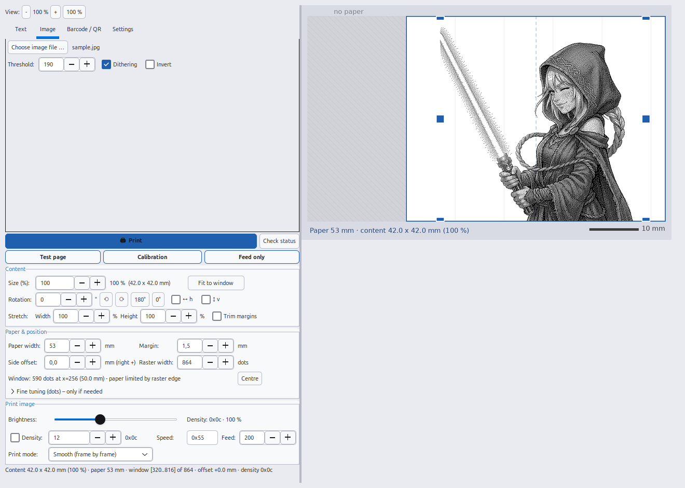
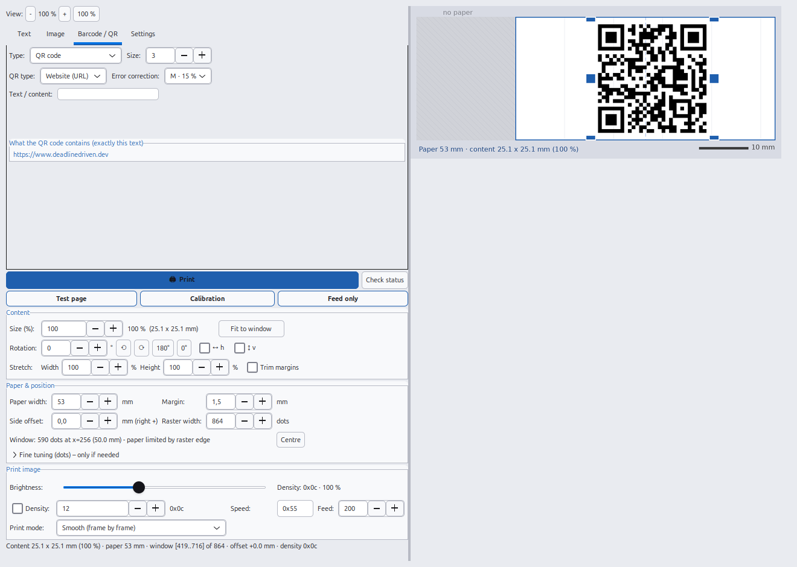

# X3 Thermal Printer on Linux – Snap &amp; Tag / ORGBRO X3 driver (CLI, CUPS, desktop GUI)

**English** · [Deutsch](README.de.md) · [日本語](README.ja.md) · [中文](README.zh.md)

[](#)
[](LICENSE)
[](#requirements)
[-lightgrey.svg)](#requirements)

**Print from a Linux PC to the Snap &amp; Tag label printer "X3" (ORGBRO X3 family) – over
Bluetooth, without root, without a phone.** The printer is a small **thermal printer**
(864 dots @ 300 dpi) that normally only works with the Android/iOS app *Snap &amp; Tag*.
This project speaks its **YK/YZW frame protocol** directly: as a **command line tool**
(`x3print.py`), as a **normal CUPS system printer** (print dialog of LibreOffice, browser,
PDF viewer …) and as a **desktop application with live preview** (`x3gui.py`, GTK3).
Text, Markdown, images (PNG/JPG/SVG), memes, **QR codes** and **EAN-13 barcodes**,
brightness/density control, rotation, mirroring, stretching and trimming are included.
Interface and documentation are available in **English, German, Japanese and Chinese**.

Website of the project: **[www.deadlinedriven.dev](https://www.deadlinedriven.dev)**



*The **image tab** with the example picture that ships with the project (`assets/sample.jpg`):
threshold 190, dithering on, exact millimetre measurements and blue handles for dragging and
scaling; the preview shows the dithered black/white result before anything is printed.*



*The **barcode / QR tab**: type *QR code*, choose what it should contain (website, Wi-Fi
access, contact/vCard, e-mail, phone, SMS, geo position or plain text) and check the field
below the form – it shows exactly what ends up in the code, here
`https://www.deadlinedriven.dev`, the project website.*

---

## Table of contents

- [X3 Thermal Printer on Linux – Snap \& Tag / ORGBRO X3 driver (CLI, CUPS, desktop GUI)](#x3-thermal-printer-on-linux--snap--tag--orgbro-x3-driver-cli-cups-desktop-gui)
  - [Table of contents](#table-of-contents)
  - [What is this?](#what-is-this)
  - [Features](#features)
  - [Supported printers and models](#supported-printers-and-models)
  - [Requirements](#requirements)
  - [Installation](#installation)
  - [Quick start](#quick-start)
  - [Command line reference](#command-line-reference)
  - [QR codes and barcodes](#qr-codes-and-barcodes)
  - [Brightness, density and print quality](#brightness-density-and-print-quality)
  - [Desktop application](#desktop-application)
  - [Use it as a system printer (CUPS)](#use-it-as-a-system-printer-cups)
  - [Troubleshooting](#troubleshooting)
  - [How the driver works](#how-the-driver-works)
  - [Project structure](#project-structure)
  - [Keywords / Suchbegriffe / キーワード / 关键词](#keywords--suchbegriffe--キーワード--关键词)
  - [License](#license)

---

## What is this?

The **X3** (also sold as *Snap &amp; Tag* printer, *ORGBRO X3*, YK/YZW protocol family) is a
**Bluetooth thermal printer** for labels, sticky notes, address labels, photos and barcodes.
The official app is Android/iOS only.

This repository is a **free, open source Linux driver and printing tool** for that device:

* **No ESC/POS** – the X3 uses a proprietary raster frame protocol (reverse engineered, see below).
* **No root, no kernel module, no `/dev/rfcomm0`** – a plain Bluetooth SPP/RFCOMM socket from Python.
* **Three ways to print**: command line, CUPS queue (`X3Thermo`), GTK3 desktop app.
* **One code base for everything** – the CLI, the GUI and the CUPS bridge share the same
  rendering pipeline and the same protocol core.

---

## Features

**Printing**

* Text (any size, alignment, bold, stroke width, line spacing), also from `stdin`
* **Japanese, Chinese and Korean text** – a CJK font (Noto Sans CJK, Droid Sans Fallback …)
  is detected automatically, so CJK content prints as real characters instead of boxes
* **Markdown**: headings, bold, italic, strikethrough, code, lists, quotes, rules and images
  inside the text (``, optionally `{50%}` or `{300}` = width in dots)
* **Layout mode**: background image plus any number of text blocks (top/middle/bottom,
  outline/bar/black styles, uppercase)
* **Images**: PNG, JPG, BMP, GIF, WebP and **SVG** (rendered sharply), threshold, dithering
  (Floyd-Steinberg), invert, autocontrast
* **Meme mode**: top and bottom text on a photo, with outline style
* **EAN-13 barcodes** and **QR codes** (website, Wi-Fi, vCard contact, e-mail, phone, SMS, geo, plain text)
* Test page, calibration ruler and paper feed commands
* **Preview to PNG** without a printer (`--out`), used by the GUI and the tests

**Image editing**

* Brightness/darkness (70–200 %), print density (4-bit), rotation (any angle, 90° steps lossless),
  mirroring, stretching X/Y separately, trimming empty margins

**Desktop application (GTK3)**

* Live preview in millimetres with paper ruler, drag &amp; drop for position, corners for
  proportional scaling, edges for width
* Three themes (dark / light / *DeadlineDriven*), four languages (English, German, Japanese, Chinese),
  UI zoom 70–140 %
* Settings are stored in `~/.config/x3drucker.json`; the window size is remembered
* Creates its own **desktop shortcut and menu entry** on first start (no root)

**System printer**

* CUPS queue **`X3Thermo`** appears in every print dialog – two variants: a user bridge
  (no `sudo`) or a native CUPS filter + backend

---

## Supported printers and models

| Printer | Protocol | Status |
|---|---|---|
| **X3 / Snap &amp; Tag** (ORGBRO X3 family, 864 dots @ 300 dpi, 53 mm paper) | YK/YZW frames over Bluetooth SPP | **verified on a real device** (this is the reference device) |
| Standard **ESC/POS** thermal printers, 58 mm and 80 mm (384 / 576 dots) | `GS v 0` raster, `ESC J` feed | supported via `--protocol escpos` / model presets |
| Other ORGBRO printers with the same frame protocol | YK/YZW | should work, reports welcome |

Model presets in the GUI: *X3 (53 mm, 864 dots)*, *ESC/POS 58 mm (48 mm, 384 dots)*,
*ESC/POS 80 mm (72 mm, 576 dots)*; geometry, paper width and raster width are set automatically.

---

## Requirements

* **Linux** with Python **3.9+** – tested on **Ubuntu 24.04** (Debian/Ubuntu, Fedora, Mint)
* **Bluetooth** (BlueZ) and a **paired** printer
* Python **Pillow**; GTK3 for the desktop app; *optional* `qrcode` for QR codes,
  *optional* Ghostscript for PDFs printed through CUPS

```bash
# Debian / Ubuntu / Mint
sudo apt install python3-pil python3-gi python3-gi-cairo gir1.2-gtk-3.0 \
                 bluez bluez-tools ghostscript
# Fedora
sudo dnf install python3-pillow python3-gobject gtk3 bluez ghostscript
```

---

## Installation

Nothing is installed system-wide – the project folder contains everything (code, icon,
example image). Tested on a real printer; no `sudo` required for the standard paths.

```bash
git clone https://github.com/Nr44suessauer/ThermalPrinterX3.git
cd ThermalPrinterX3
chmod +x *.sh scripts/*.sh

./scripts/install.sh --check      # check dependencies and system state (changes nothing)
./scripts/install.sh              # menu entry + desktop shortcut, pairing, optional CUPS
./scripts/pair.sh                 # pair the printer (PIN is usually 0000)
./x3gui.sh                        # start the desktop application
```

Step-by-step instructions (including uninstall and troubleshooting) are in
[`INSTALL.md`](INSTALL.md) *(German)* and in the sections below.

---

## Quick start

```bash
python3 x3print.py status                       # connection + firmware/status bytes
python3 x3print.py text "Hello from the PC"     # first page
python3 x3print.py text --align center --size 48 --bold "IMPORTANT"
python3 x3print.py image photo.jpg              # image (PNG/JPG/SVG/...)
python3 x3print.py ean13 4006381333931          # EAN-13 barcode
python3 x3print.py qr --type url example.org    # QR code (website)
python3 x3print.py qr --type wifi --ssid "MyNetwork" --password "secret"
python3 x3print.py markdown --file notes.md     # Markdown file
python3 x3print.py meme photo.jpg --top "Hello" --bottom "Thermal printer X3"
python3 x3print.py feed 200                     # feed paper
python3 x3print.py demo                         # demo page
python3 x3print.py demo --out /tmp/preview.png  # preview only, no printer needed
```

The printer is found automatically (`bluetoothctl`); a MAC address can be given with
`--mac AA:BB:CC:DD:EE:FF` if several devices are around – nothing is hard-coded.

---

## Command line reference

| Command | What it does |
|---|---|
| `status` | connect and read firmware + status bytes |
| `text [TEXT]` | print text (from the argument, several words or `stdin`) |
| `file FILE` | print a text file |
| `image FILE` | print an image (threshold, dithering, invert) |
| `ean13 CODE` | print an EAN-13 barcode (12 or 13 digits) |
| `qr CONTENT` | print a QR code (`--type text/url/wifi/vcard/email/tel/sms/geo`) |
| `markdown` | print Markdown (`--file notes.md` or inline text) |
| `meme IMAGE` | image with top/bottom text |
| `feed [STEPS]` | feed paper only |
| `demo` | demo page (text, umlauts, barcode, QR) |
| `calibrate` | calibration ruler over the full raster width |

**Common options:** `--mac`, `--width`/`--left` (print window), `--dots` (raster width, default 864),
`--speed`, `--density`, `--brightness` (70–200 %), `--zoom`, `--rotate`, `--flip`,
`--stretch`, `--trim`, `--feed`, `--mode app|fast` (both stream without pauses),
`--protocol x3|escpos`, `--delay` (artificial delay, 0 = off), `--out FILE` (preview PNG).

```bash
python3 x3print.py --version                    # 1.0.0
python3 x3print.py text --help                  # all options of a command
```

---

## QR codes and barcodes

The QR generator is in the GUI (*Barcode / QR* tab) and in the command line. Requires the
`qrcode` library once: `pip3 install --user --break-system-packages qrcode`.

| Type | What a phone does when scanning | Fields |
|---|---|---|
| `url` | opens the website (`https://` is added) | web address |
| `wifi` | joins the Wi-Fi network (Android/iOS) | SSID, password, WPA/WEP/open, hidden SSID |
| `vcard` | adds a contact | name, phone, e-mail, company, website |
| `email` | opens the mail app with recipient/subject/body | to, subject, message |
| `tel` | shows the number to call | phone number |
| `sms` | pre-fills a text message | number, text |
| `geo` | opens the map at that position | latitude, longitude |
| `text` | shows the plain text | any text |

Error correction L (7 %) / M (15 %) / Q (25 %) / **H (30 %, recommended for thermal paper)**
– special characters in Wi-Fi passwords (`;` `,` `:` `"` `\`) are escaped correctly.
The default content of the text tab and of the QR preset is **`www.deadlinedriven.dev`**,
so a fresh installation prints the project website right away.

---

## Brightness, density and print quality

`--brightness PERCENT` (default 100) controls the blackness on two levels:

1. **Printer density** (command `0x09`) – computed from the percentage. The density field is
   only **4 bits** wide (`0x02`…`0x0f`); larger values print *lighter*, not darker.
   Curve: 70 % → `0x09`, 100 % → `0x0c`, 130 % → `0x0d`, 200 % → `0x0f`.
2. **Image gain** (images and CUPS) – grey levels are darkened/brightened before the
   black/white threshold, which is very visible on photos and logos.

Useful range ≈ 70–160 %. `--density 0x..` overrides the computed value.
In the CUPS dialog the option is called *print darkness* (70/100/130/160 %).

**Faint print** → `--thicken 1` or a higher density; **too dark / bleeding** → lower density.
The print head always prints at the same resolution (300 dpi, 864 dots) – content size is
controlled with `--zoom` (CLI) or *Size (%)* (GUI).

---

## Desktop application

```bash
./x3gui.sh                        # start (wrapper clears the VS Code snap environment)
./x3gui.sh --selftest             # build the interface and render the preview, then exit
./x3gui.sh --version              # version
```

* Tabs **Text / Image / Barcode &amp; QR / Settings**, print button plus *Check status*,
  *Test page*, *Calibration*, *Feed only*
* **Starts in the language of your system** – English, German, Japanese or Chinese;
  the installer and the menu entry are localized as well. Change it any time in
  *Settings → Design → Language*
* Live preview: printable area highlighted, hatched = no paper, red = sticks out,
  millimetre ruler, blue centre line, all measurements in dots and mm
* Drag to position, drag corners to scale proportionally, drag edges to change the width
* **Layout mode** (background image + text blocks), **meme** text, **Markdown** with live rendering
* **Automatic desktop shortcut + menu entry** on first start; creating/removing also from
  *Settings → Design* or with `./scripts/install-desktop.sh`
* Everything is stored in `~/.config/x3drucker.json`

| Language | Image tab | Barcode / QR tab |
|---|---|---|
| English | [gui-image-en.png](docs/images/gui-image-en.png) | [gui-qr-en.png](docs/images/gui-qr-en.png) |
| Deutsch | [gui-image-de.png](docs/images/gui-image-de.png) | [gui-qr-de.png](docs/images/gui-qr-de.png) |
| 日本語 | [gui-image-ja.png](docs/images/gui-image-ja.png) | [gui-qr-ja.png](docs/images/gui-qr-ja.png) |
| 中文 | [gui-image-zh.png](docs/images/gui-image-zh.png) | [gui-qr-zh.png](docs/images/gui-qr-zh.png) |

The GUI and the CUPS queue use the same settings – what you see in the preview is what the
`X3Thermo` printer sends. See [日本語](README.ja.md) / [中文](README.zh.md) for the
Japanese and Chinese README versions.

---

## Use it as a system printer (CUPS)

**Variant A – bridge, no `sudo` (recommended):**

```bash
./scripts/install-cups-user.sh            # creates the queue X3Thermo + user service
./scripts/install-cups-user.sh --uninstall
systemctl --user status x3bridge          # service state
journalctl --user -u x3bridge -f          # live log
```

`X3Thermo` then appears in every print dialog. The bridge accepts PDF/PostScript
(via Ghostscript at 300 dpi), images and plain text.

**Variant B – native CUPS filter + backend (needs `sudo` once):**

```bash
sudo bash scripts/install-cups.sh                 # MAC is detected automatically
sudo bash scripts/install-cups.sh AA:BB:CC:DD:EE:FF
sudo bash scripts/install-cups.sh --uninstall
```

---

## Troubleshooting

| Problem | Solution |
|---|---|
| `No printer found …` | switch the printer on, run `./scripts/pair.sh` (PIN usually `0000`), make the device *trusted* |
| **Printer does not connect any more** (`timed out`) | the Bluetooth session is stale – the X3 accepts only **one** client, so an old session blocks the channel even though the PC shows `Connected: yes`. The driver drops the link itself and retries (first print then takes a few seconds longer). Manually: `bluetoothctl disconnect AA:BB:CC:DD:EE:FF`, or switch the printer off and on |
| `Device or resource busy` | the printer is still working on the previous job – wait a moment, the driver retries by itself |
| **Printer stops in the middle of a page** | the print head was faster than the data stream. Both modes send **without pauses** (the printer's buffer sets the pace) – if it still stops: check the Bluetooth link (printer nearby, no second host connected), do **not** set `--delay`, try `--mode fast` (larger blocks). Very dark/large images can also be slowed by head heat – lower the density |
| Print is doubled/chopped | wrong raster width – check `--dots` (432 vs 864) |
| Content is not centred / cut off | adjust `--width`/`--left` (use `calibrate` to find the window) |
| Too faint | `--thicken 1`, density `0x0e`…`0x0f`, bigger content (`--zoom`) |
| QR code not needed | `pip3 install --user --break-system-packages qrcode` |
| GUI does not start | always start it through `./x3gui.sh` (it clears the snap environment variables) |
| CUPS job hangs | `journalctl --user -u x3bridge -f`, `lpstat -p X3Thermo` |
| CUPS: `X3Thermo` missing | re-run `./scripts/install-cups-user.sh`, check `lpstat -p X3Thermo` |

---

## How the driver works

* **Bluetooth:** the X3 offers **SPP (RFCOMM channel 1)**. The driver connects directly with
  `socket(AF_BLUETOOTH, SOCK_STREAM, BTPROTO_RFCOMM)` – no `rfcomm` bind, no root.
* **Protocol:** every command is a frame
  `64 <cmd> <seq> <len_lo> <len_hi> <payload> 00 00 00 00 9b` with
  `0x80` token/init, `0x0a` speed, `0x09` density, `0x00` raster, `0x02` feed.
  A job is always: **speed → density → raster frames (432 bytes = 4 rows) → feed**.
* **Raster:** the head is **864 dots wide @ 300 dpi** (108 bytes per row, MSB first, 1 = black).
  Content is rendered to a 1-bit image and embedded into the raster.
* **Sending:** the whole job goes out as **one continuous stream**; the RFCOMM flow control
  paces it (writes block while the printer is busy). A gap would stop the motor mid-page.
  Before closing, a status query is sent behind the job – its reply means the printer has
  read everything.
* **CUPS:** the bridge listens on `socket://127.0.0.1:9101`, renders the job exactly like the
  GUI and sends it through the same driver.

Everything (protocol tables, geometry, measured hardware values, PlantUML diagrams) is
documented in **[`docs/`](docs/README.md)** (English) and in [`README.de.md`](README.de.md) (German).

Reverse engineering sources that made this possible:
[`isma-co/ORGBRO-X3-Windows`](https://github.com/isma-co/ORGBRO-X3-Windows),
[`a-gians/Open-Orgbro`](https://github.com/a-gians/Open-Orgbro).

---

## Project structure

```
x3print.py            driver + renderers + command line (library)
x3gui.py              desktop application (GTK3)
i18n.py               translations: English source → German / Japanese / Chinese
x3gui.sh              start wrapper (clears the snap environment variables)
assets/               app icon and the example image shipped with the project
scripts/              installers, pairing, desktop entry template
cups/                 CUPS bridge (variant A) and native filter/backend (variant B)
docs/                 technical documentation (English) + PlantUML diagrams + screenshots
tests/                self-tests without a printer (rendering, frames, ESC/POS, CUPS bridge)
README.md             this file (English) · README.de.md · README.ja.md · README.zh.md
INSTALL.md            step-by-step installation (German)
CHANGELOG.md          version history (German)
```

```bash
python3 tests/test_smoke.py        # self-tests, exit code 0 = everything OK
docs/diagrams/build.sh             # re-render the diagrams (needs PlantUML + GraphViz)
```

---

## Keywords / Suchbegriffe / キーワード / 关键词

**English:** thermal printer Linux, Bluetooth thermal printer, Snap &amp; Tag printer,
ORGBRO X3, YK/YZW protocol, label printer, receipt printer, sticker printer, photo printer,
thermal printer driver, Python thermal printer, CUPS Bluetooth printer, ESC/POS alternative,
QR code printer, barcode printer EAN-13, Markdown printing, GTK3 application, print labels
without the phone app, reverse engineered printer protocol, Ubuntu / Debian / Fedora.

**Deutsch:** Thermodrucker Linux, Bluetooth Thermodrucker, Snap &amp; Tag Drucker, ORGBRO X3,
Etikettendrucker, Bon-Drucker, Aufkleber drucken, Thermodrucker Treiber, CUPS Bluetooth,
QR-Code drucken, Barcode drucken, Markdown drucken, Linux Drucker ohne Handy-App,
Kassenzettel, Klebeetiketten, Thermodrucker Python.

**日本語:** サーマルプリンター Linux, Bluetooth サーマルプリンター, ラベルプリンター,
Snap &amp; Tag プリンター, ORGBRO X3, QR コード 印刷, バーコード 印刷, CUPS プリンター,
Linux プリンター ドライバー, 感熱紙プリンター, スマホなしで印刷.

**中文:** 热敏打印机 Linux, 蓝牙热敏打印机, 标签打印机, 小票打印机, 貼紙打印,
Snap &amp; Tag 打印机, ORGBRO X3, QR 码打印, 条形码打印, CUPS 蓝牙打印机,
Linux 打印驱动, 免手机打印, 热敏纸.

---

## License

**MIT license** – see [`LICENSE`](LICENSE). Copyright (c) 2026 Marc Nauendorf.

Use, modification and redistribution are allowed as long as the copyright notice is kept;
no warranty. Protocol documentation included here comes from the reverse engineering
projects linked above; this project is not affiliated with ORGBRO or the *Snap &amp; Tag* app.
