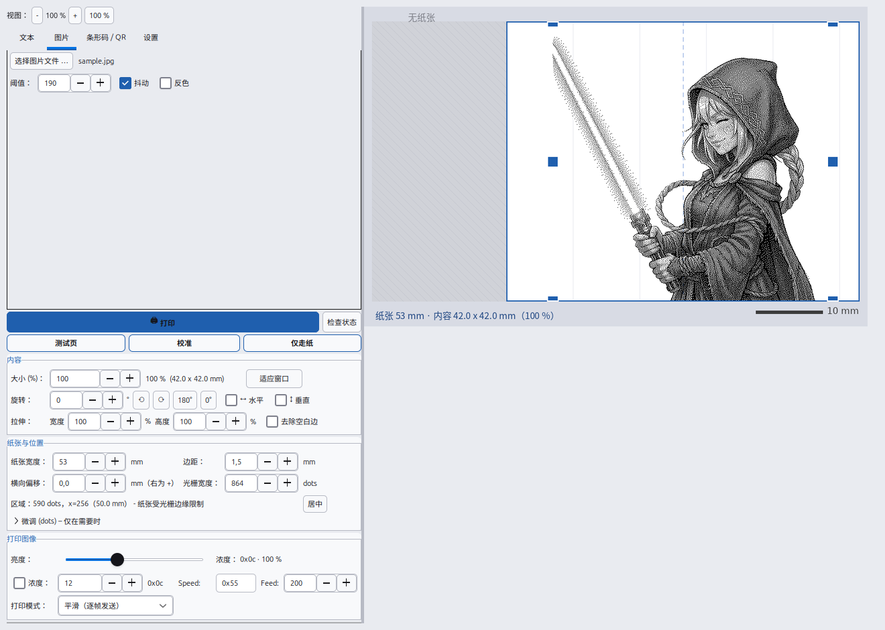
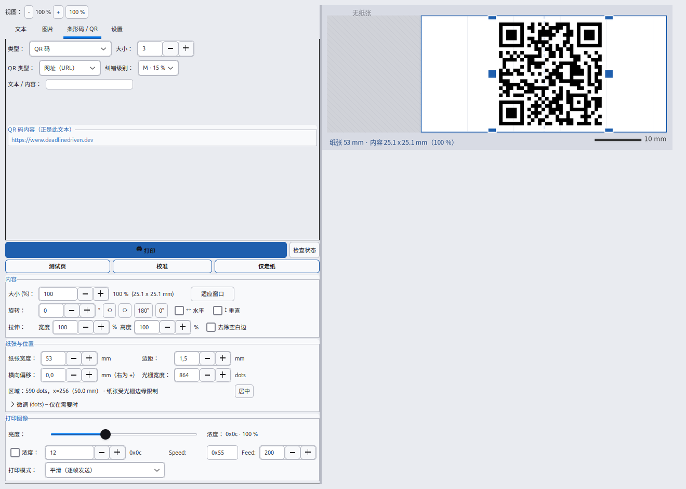

# 在 Linux 上使用 X3 热敏打印机 – Snap &amp; Tag / ORGBRO X3 驱动（命令行 · CUPS · 图形界面）

[English](README.md) · [Deutsch](README.de.md) · [日本語](README.ja.md) · **中文**

[](#)
[](LICENSE)
[](#环境要求)

**用 Linux 电脑通过蓝牙直接打印到「X3」热敏打印机（Snap &amp; Tag、ORGBRO X3 系列）——
不需要 root，也不需要手机。** 这类打印机通常只能用手机 App *Snap &amp; Tag*，本项目直接使用其
**YK/YZW 帧协议**，提供三种打印方式：**命令行**（`x3print.py`）、**CUPS 系统打印机**
（LibreOffice、浏览器、PDF 阅读器的打印对话框中显示为 `X3Thermo`）以及**带实时预览的桌面程序**
（`x3gui.py`，GTK3）。支持文本、Markdown、图片（PNG/JPG/SVG）、表情包、**二维码**、
**EAN-13 条形码**、亮度/浓度、旋转、镜像、拉伸与裁边。界面和文档提供
**英语、德语、日语和中文**。

项目网站：**[www.deadlinedriven.dev](https://www.deadlinedriven.dev)**



***「图片」选项卡**与项目自带的示例图片（`assets/sample.jpg`）：阈值 190、启用抖动、
毫米级尺寸标注、可用蓝色手柄拖动和缩放；预览会先显示黑白处理后的结果。*



***「条形码 / QR」选项卡**：选择「二维码」并指定内容类型（网址、Wi-Fi、联系人、
邮件、电话、短信、位置或纯文本）。表单下方的字段会显示写入二维码的确切内容——
这里是 `https://www.deadlinedriven.dev`，即项目网站。*

---

## 功能

* **文本打印**（字号、居中/左右对齐、粗体、描边、行距），也可从标准输入读取
* **日文、中文、韩文文本** – 自动选择合适的 CJK 字体（Noto Sans CJK 等），
  中文和日文会打印成真正的文字，而不是方框
* **Markdown**：标题、粗体、斜体、删除线、代码、列表、引用、分隔线，正文中插入图片
  （``，可用 `{50%}` 或 `{300}` 指定宽度）
* **排版模式**：背景图片 + 任意数量的文本块（上/中/下，轮廓、色条、纯黑三种样式）
* **图片**：PNG、JPG、BMP、GIF、WebP、**SVG**（矢量渲染，放大也清晰），阈值、抖动、反色
* **表情包模式**：在照片上打印上下文字（带描边，清晰可读）
* **EAN-13 条形码**与**二维码**（网址、Wi-Fi、联系人 vCard、邮件、电话、短信、位置、文本）
* 测试页、校准标尺、单独走纸
* **无需打印机即可预览**（`--out` 保存 PNG）
* **图像处理**：亮度 70–200 %、浓度（4 位）、旋转（任意角度，90° 无损）、镜像、横纵分别拉伸、裁掉空白边
* **桌面程序**：以毫米为单位的实时预览，拖动移动、拖角缩放、拖边改宽度；
  三套主题，界面缩放 70–140 %，设置保存在 `~/.config/x3drucker.json`
* **首次启动自动创建桌面快捷方式和菜单项**（不需要 root）
* **CUPS**：创建打印队列 `X3Thermo`（免 sudo 的桥接方式，或原生过滤器方式）

## 支持的打印机

| 打印机 | 协议 | 状态 |
|---|---|---|
| **X3 / Snap &amp; Tag**（ORGBRO X3 系列，864 点 @ 300 dpi，53 mm 纸） | 蓝牙 SPP 上的 YK/YZW 帧 | **已在真机验证** |
| 通用 **ESC/POS** 热敏打印机 58 mm / 80 mm（384 / 576 点） | `GS v 0` 光栅、`ESC J` 走纸 | 用 `--protocol escpos` 或选择机型模板 |

## 环境要求

* **Linux** 与 Python **3.9+**（在 Ubuntu 24.04 上验证；Debian/Ubuntu、Fedora、Mint 均可）
* **蓝牙**（BlueZ）以及已配对的打印机
* Python **Pillow**；桌面程序需要 GTK3；二维码需要 `qrcode`（可选）；
  通过 CUPS 打印 PDF 需要 Ghostscript（可选）

```bash
# Debian / Ubuntu / Mint
sudo apt install python3-pil python3-gi python3-gi-cairo gir1.2-gtk-3.0 \
                 bluez bluez-tools ghostscript
# Fedora
sudo dnf install python3-pillow python3-gobject gtk3 bluez ghostscript
```

## 安装与开始

```bash
git clone https://github.com/Nr44suessauer/ThermalPrinterX3.git
cd ThermalPrinterX3
chmod +x *.sh scripts/*.sh

./scripts/install.sh --check      # 只检查依赖（不做修改）
./scripts/install.sh              # 菜单项 + 快捷方式 + 配对 + CUPS（可选）
./scripts/pair.sh                 # 配对打印机（PIN 通常为 0000）
./x3gui.sh                        # 启动桌面程序
```

## 命令行示例

```bash
python3 x3print.py status                       # 连接并读取固件/状态
python3 x3print.py text "来自电脑的打印"          # 打印第一页
python3 x3print.py text --align center --size 48 --bold "重要"
python3 x3print.py image photo.jpg              # 打印图片（PNG/JPG/SVG 等）
python3 x3print.py ean13 4006381333931          # EAN-13 条形码
python3 x3print.py qr --type url example.org    # 二维码（网址）
python3 x3print.py qr --type wifi --ssid "MyNetwork" --password "secret"
python3 x3print.py markdown --file notes.md     # 打印 Markdown 文件
python3 x3print.py meme photo.jpg --top "你好" --bottom "X3"
python3 x3print.py feed 200                     # 只走纸
python3 x3print.py demo --out /tmp/preview.png  # 只生成预览（不需要打印机）
```

| 命令 | 说明 |
|---|---|
| `status` | 连接并读取固件与状态 |
| `text` / `file` | 打印文本 / 文本文件 |
| `image` | 打印图片（阈值、抖动、反色） |
| `ean13` / `qr` | EAN-13 条形码 / 二维码（类型用 `--type`） |
| `markdown` | 打印 Markdown（`--file` 或直接文本） |
| `meme` | 图片加上下文字 |
| `feed` / `demo` / `calibrate` | 走纸 / 演示页 / 打印标尺 |

常用参数：`--mac`、`--width` / `--left`、`--dots`、`--speed`、`--density`、
`--brightness`（70–200 %）、`--zoom`、`--rotate`、`--flip`、`--stretch`、`--trim`、
`--feed`、`--mode app|fast`（两种模式都连续发送，不会停顿）、`--protocol x3|escpos`、
`--delay`（0 = 关闭）、`--out`（预览）。

## 亮度与浓度

`--brightness` 分两级生效：(1) 打印机浓度命令 `0x09`（**只有 4 位有效**，`0x02`–`0x0f`，
再大的值反而更浅），(2) 图像增益（图片与 CUPS 路径）。建议范围 70–160 %；
也可用 `--density 0x..` 直接指定。

## 作为系统打印机使用（CUPS）

```bash
./scripts/install-cups-user.sh            # 免 sudo：创建队列 X3Thermo + 用户服务
systemctl --user status x3bridge          # 查看状态
journalctl --user -u x3bridge -f          # 查看日志
sudo bash scripts/install-cups.sh         # 原生方式（需要 sudo，可选）
```

## 常见问题

| 现象 | 解决办法 |
|---|---|
| `No printer found …` | 打开打印机电源，运行 `./scripts/pair.sh`（PIN 通常为 `0000`），并将设备设为可信 |
| **打印中途停下** | 原因是数据传输有停顿，现已修复（两种模式都连续发送）。若仍出现：检查蓝牙连接，**不要**设置 `--delay`，改用 `--mode fast`，并降低浓度 |
| 打印重影/错乱 | 光栅宽度不对 → 检查 `--dots`（432 / 864） |
| 位置偏移或被裁掉 | 调整 `--width` / `--left`（用 `calibrate` 确定打印窗口） |
| 颜色太浅 | `--thicken 1`、浓度 `0x0e`–`0x0f`、用 `--zoom` 放大内容 |
| 图形界面无法启动 | 请始终用 `./x3gui.sh` 启动（它会清理 snap 的环境变量） |

## 工作原理

* **蓝牙**：X3 提供 SPP（RFCOMM 通道 1），用 Python 的 `AF_BLUETOOTH` 套接字直连，无需 root
* **协议**：`64 <cmd> <seq> <len_lo> <len_hi> <payload> 00 00 00 00 9b`
  （`0x80` 初始化、`0x0a` 速度、`0x09` 浓度、`0x00` 光栅、`0x02` 走纸）
* **光栅**：864 点 @ 300 dpi，每行 108 字节，每帧 432 字节（4 行）
* **发送**：整个任务**连续**发送，速度由蓝牙流控决定（有停顿就会停电机）
* **CUPS**：桥接程序监听 `socket://127.0.0.1:9101`，用与图形界面相同的设置渲染并发送

更多技术细节（英文）与 PlantUML 图：[`docs/`](docs/README.md)。
德语详细说明：[`README.de.md`](README.de.md)。

## 关键词

Linux 热敏打印机 · 蓝牙热敏打印机 · 标签打印机 · 小票打印机 · 贴纸打印 ·
Snap &amp; Tag 打印机 · ORGBRO X3 · YK/YZW 协议 · 热敏纸打印 · QR 码打印 ·
条形码打印 · CUPS 蓝牙打印机 · Linux 打印驱动 · Python · GTK3 ·
不用手机打印 · 打印机协议逆向工程

## 许可证

**MIT 许可证** – 见 [`LICENSE`](LICENSE)。Copyright (c) 2026 Marc Nauendorf。
不提供任何担保。协议资料来自上面列出的逆向工程项目；本项目与 ORGBRO 及
*Snap &amp; Tag* 应用无任何关联。
