# Diagrams – X3 Thermal Printer

All diagrams of the documentation, written in **PlantUML** (sources: `.puml` files
in this folder). Every diagram exists as **SVG** (sharp, for documentation and web)
and as **PNG** (easy to embed anywhere).

Render them again after changing a `.puml` file:

```bash
./build.sh                     # renders SVG + PNG from every *.puml
```

Requirements: `plantuml` in `PATH` (see below) and GraphViz (`dot`).

---

## Overview

| # | Diagram | Type | Shows |
|---|---|---|---|
| 01 | [Use cases](01-use-cases.puml) | use case | what users and other programs can do with the X3 |
| 02 | [Architecture](02-architecture.puml) | component | modules (GUI, core, CUPS integration, i18n) and their interfaces |
| 03 | [Deployment](03-deployment.puml) | deployment | where everything lives: project folder, config, .desktop, systemd service, printer |
| 04 | [Printing from the CLI](04-sequence-cli-print.puml) | sequence | from the command to the finished YK/YZW frame |
| 05 | [Printing through CUPS](05-sequence-cups.puml) | sequence | print dialog → queue → bridge → Bluetooth |
| 06 | [Using the user interface](06-sequence-gui.puml) | sequence | pick the content, preview, adjust with the mouse, print |
| 07 | [Preparing the print image](07-activity-rendering.puml) | activity | load → scale → edit → threshold/dithering → embed |
| 08 | [Drivers & renderers](08-classes-core.puml) | class | `X3Printer`, `EscPosPrinter`, `make_printer()`, renderer functions |
| 09 | [Structure of the user interface](09-classes-gui.puml) | class | `X3App` with jobs, state and helpers |
| 10 | [Connection states](10-state-connection.puml) | state | lookup, connect, send, disconnect – including error paths |
| 11 | [Installation & first start](11-activity-installation.puml) | activity | from `scripts/install.sh` to the first print |
| 12 | [User interface (wireframe)](12-user-interface.puml) | wireframe (salt) | arrangement of the controls and the preview |
| 13 | [Hardware facts](13-hardware-facts.puml) | table (salt) | the values measured on the device (head, window, density …) |

---

## 01 – Use cases

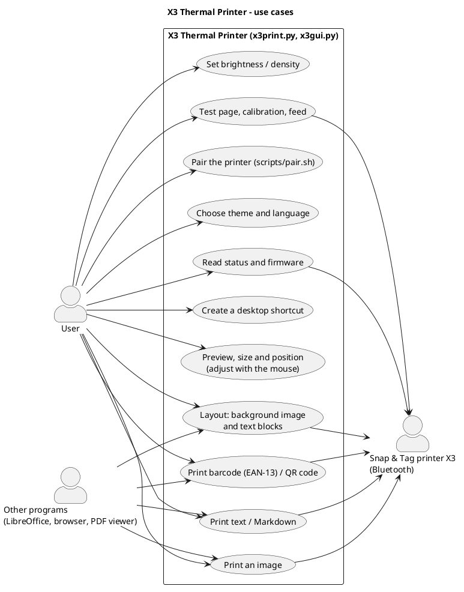

## 02 – Architecture (components and interfaces)

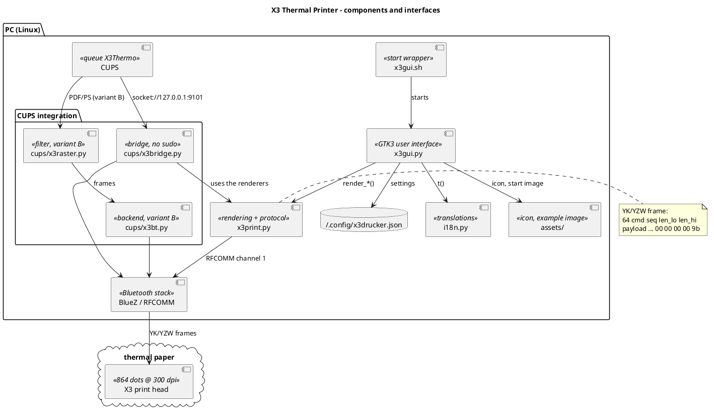

## 03 – Deployment

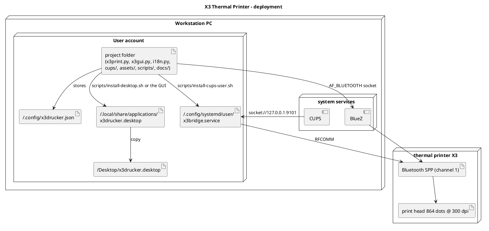

## 04 – Print job from the command line

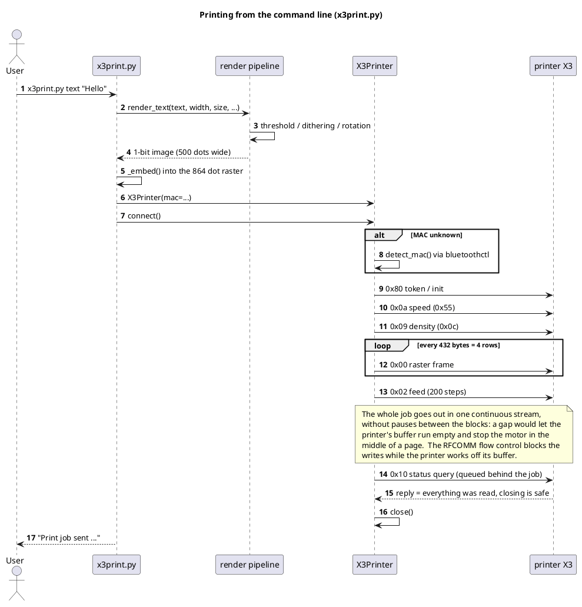

## 05 – Print job through CUPS

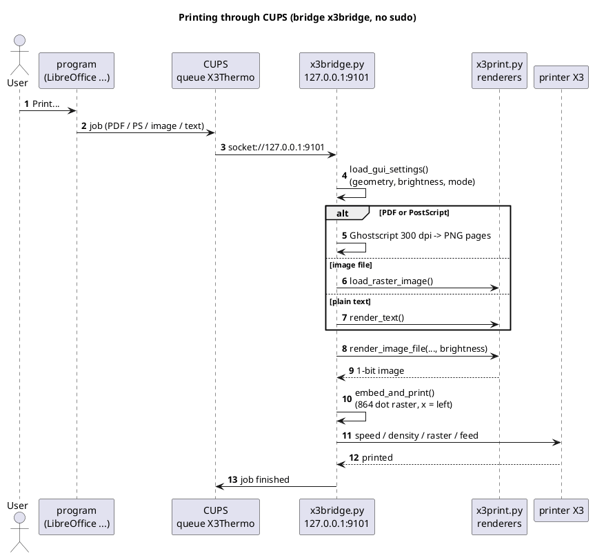

## 06 – Using the user interface

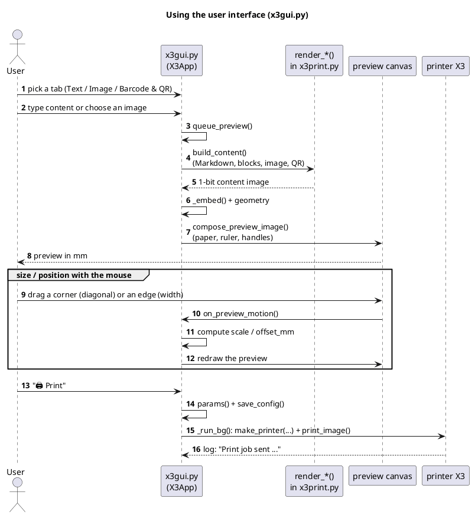

## 07 – Preparing the print image

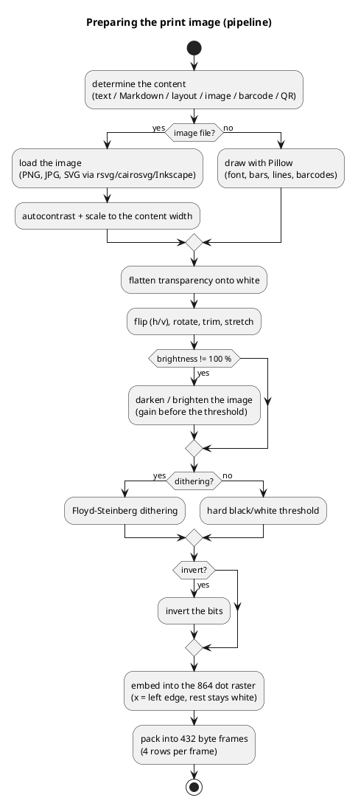

## 08 – Drivers and renderers (`x3print.py`)

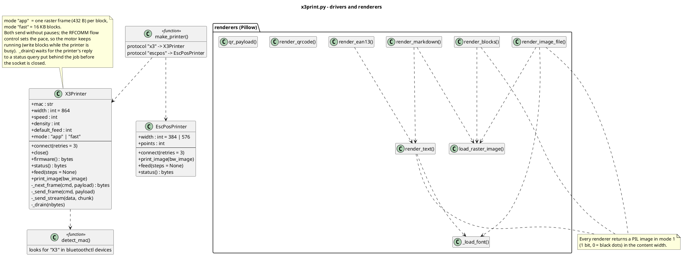

## 09 – Structure of the user interface (`x3gui.py`)

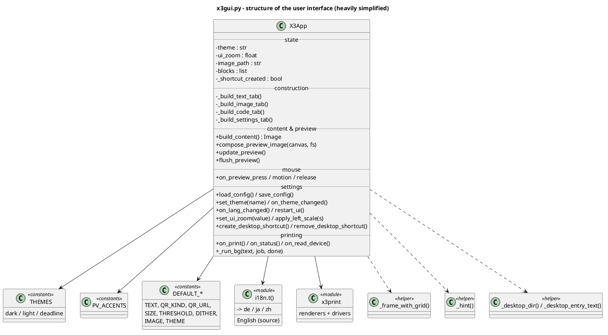

## 10 – Connection states

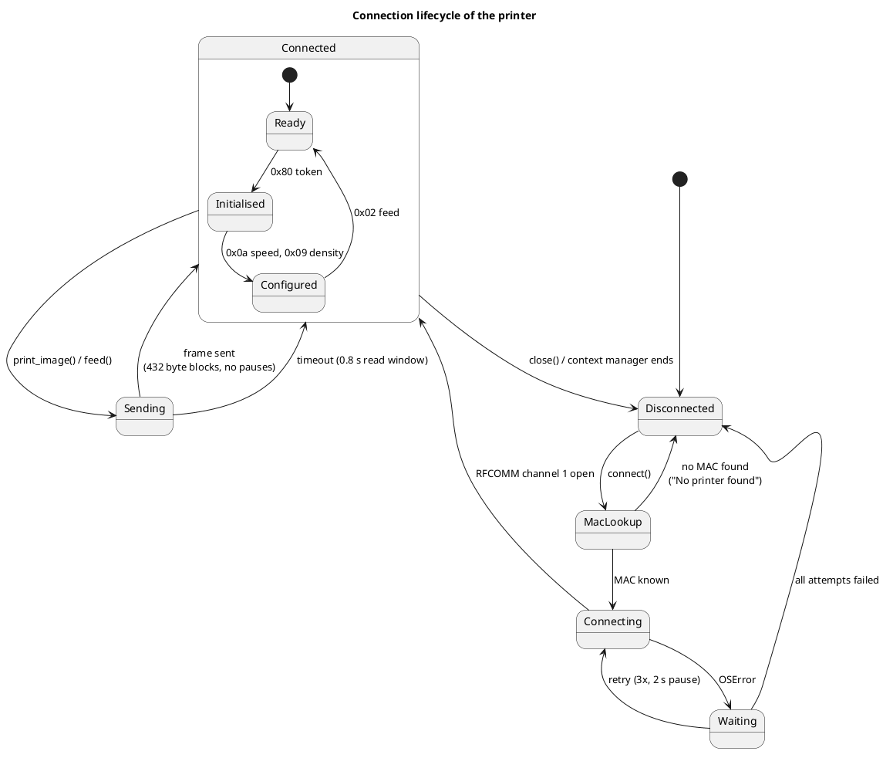

## 11 – Installation and first start

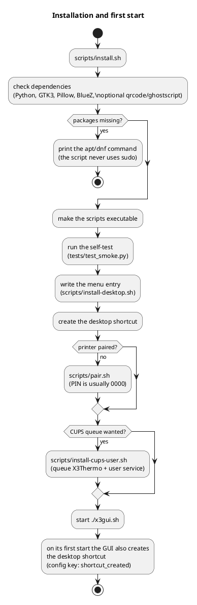

## 12 – User interface (wireframe)

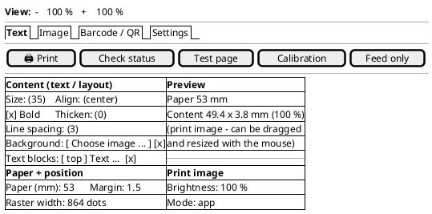

## 13 – Hardware facts

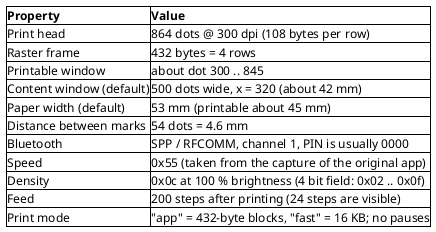

---

## Installing PlantUML (if it is not there yet)

Java and GraphViz are needed; both are installed in a moment on the usual
distributions (`sudo apt install default-jre graphviz`).
PlantUML itself runs without installation as a JAR:

```bash
mkdir -p ~/Applications/plantuml && cd ~/Applications/plantuml
wget -O plantuml.jar \
  https://github.com/plantuml/plantuml/releases/latest/download/plantuml.jar

# small wrapper so that "plantuml" can be called directly
mkdir -p ~/bin && printf '#!/usr/bin/env bash\nexec java -jar "$HOME/Applications/plantuml/plantuml.jar" "$@"\n' > ~/bin/plantuml
chmod +x ~/bin/plantuml
plantuml -version
```
